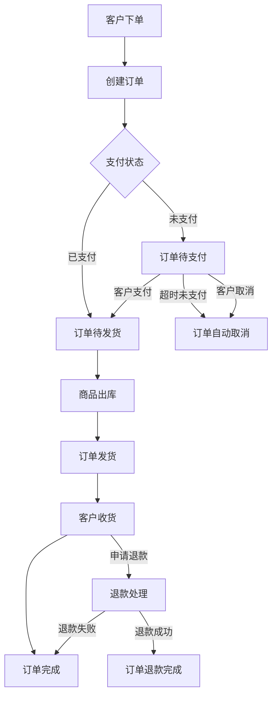
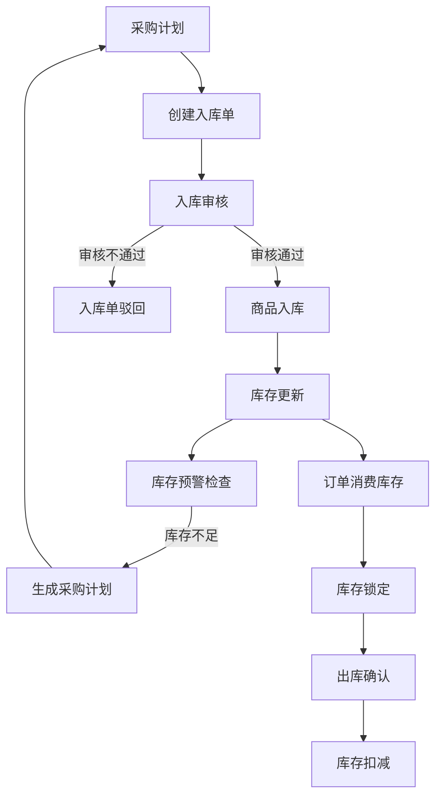
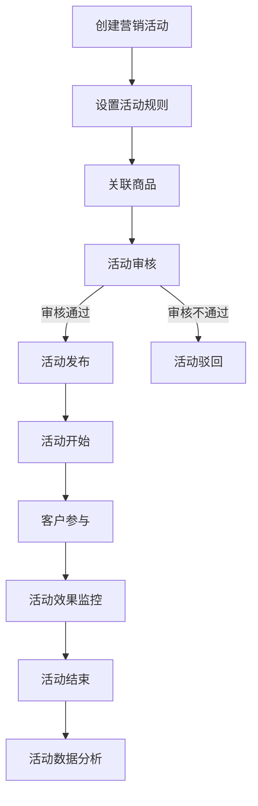

# 购物平台后台管理系统设计方案

## 系统概述

本设计方案基于帝可得后台管理系统的架构思想，为购物平台设计一套完整的后台管理系统。该系统将实现商品管理、订单处理、客户管理、营销活动等核心功能，提供高效的电商运营管理能力。

## 系统架构

系统采用前后端分离架构：
- 前端：Vue.js + Element UI
- 后端：Spring Boot + MyBatis
- 数据库：MySQL
- 缓存：Redis
- 文件存储：阿里云OSS

## 核心模块设计

### 1. 客户管理模块

#### 功能列表
- 客户列表查询与管理
- 客户详情查看
- 客户权限分配
- 客户状态管理（启用/禁用）
- 客户行为分析
- 会员等级管理

#### 核心表结构
```sql
-- 客户表
CREATE TABLE `tb_customer` (
  `id` BIGINT AUTO_INCREMENT COMMENT '客户ID',
  `username` VARCHAR(64) NOT NULL COMMENT '用户名',
  `password` VARCHAR(100) NOT NULL COMMENT '密码',
  `phone` VARCHAR(20) COMMENT '手机号',
  `email` VARCHAR(100) COMMENT '邮箱',
  `avatar` VARCHAR(255) COMMENT '头像',
  `gender` TINYINT DEFAULT 0 COMMENT '性别：0未知，1男，2女',
  `birthday` DATE COMMENT '生日',
  `customer_level` INT DEFAULT 0 COMMENT '会员等级',
  `status` TINYINT DEFAULT 1 COMMENT '状态：0禁用，1启用',
  `create_time` DATETIME DEFAULT CURRENT_TIMESTAMP COMMENT '创建时间',
  `update_time` DATETIME DEFAULT CURRENT_TIMESTAMP ON UPDATE CURRENT_TIMESTAMP COMMENT '更新时间',
  `last_login_time` DATETIME COMMENT '最后登录时间',
  `create_by` VARCHAR(64) COMMENT '创建人',
  `update_by` VARCHAR(64) COMMENT '更新人',
  PRIMARY KEY (`id`),
  UNIQUE KEY `idx_username` (`username`),
  UNIQUE KEY `idx_phone` (`phone`)
) ENGINE=InnoDB DEFAULT CHARSET=utf8mb4 COMMENT='客户表';

-- 会员等级表
CREATE TABLE `tb_customer_level` (
  `id` INT AUTO_INCREMENT COMMENT '等级ID',
  `level_name` VARCHAR(50) NOT NULL COMMENT '等级名称',
  `min_point` INT NOT NULL COMMENT '最低积分',
  `max_point` INT NOT NULL COMMENT '最高积分',
  `discount` DECIMAL(3,2) DEFAULT 1.00 COMMENT '折扣率',
  `description` VARCHAR(200) COMMENT '等级描述',
  `create_time` DATETIME DEFAULT CURRENT_TIMESTAMP COMMENT '创建时间',
  `update_time` DATETIME DEFAULT CURRENT_TIMESTAMP ON UPDATE CURRENT_TIMESTAMP COMMENT '更新时间',
  `create_by` VARCHAR(64) COMMENT '创建人',
  `update_by` VARCHAR(64) COMMENT '更新人',
  PRIMARY KEY (`id`)
) ENGINE=InnoDB DEFAULT CHARSET=utf8mb4 COMMENT='会员等级表';
```


### 2. 商品管理模块

#### 功能列表
- 商品分类管理
- 商品品牌管理
- 商品属性管理
- 商品规格管理
- 商品信息管理
- 商品上架/下架
- 商品批量导入/导出
- 商品审核

#### 核心表结构
```sql
-- 商品分类表
CREATE TABLE `tb_category` (
  `id` BIGINT AUTO_INCREMENT COMMENT '分类ID',
  `parent_id` BIGINT DEFAULT 0 COMMENT '父分类ID',
  `name` VARCHAR(50) NOT NULL COMMENT '分类名称',
  `level` INT DEFAULT 1 COMMENT '层级',
  `sort` INT DEFAULT 0 COMMENT '排序',
  `icon` VARCHAR(255) COMMENT '图标',
  `is_show` TINYINT DEFAULT 1 COMMENT '是否显示：0不显示，1显示',
  `create_time` DATETIME DEFAULT CURRENT_TIMESTAMP COMMENT '创建时间',
  `update_time` DATETIME DEFAULT CURRENT_TIMESTAMP ON UPDATE CURRENT_TIMESTAMP COMMENT '更新时间',
  `create_by` VARCHAR(64) COMMENT '创建人',
  `update_by` VARCHAR(64) COMMENT '更新人',
  PRIMARY KEY (`id`),
  KEY `idx_parent_id` (`parent_id`)
) ENGINE=InnoDB DEFAULT CHARSET=utf8mb4 COMMENT='商品分类表';

-- 商品品牌表
CREATE TABLE `tb_brand` (
  `id` BIGINT AUTO_INCREMENT COMMENT '品牌ID',
  `name` VARCHAR(50) NOT NULL COMMENT '品牌名称',
  `logo` VARCHAR(255) COMMENT '品牌logo',
  `description` VARCHAR(512) COMMENT '品牌描述',
  `sort` INT DEFAULT 0 COMMENT '排序',
  `is_show` TINYINT DEFAULT 1 COMMENT '是否显示：0不显示，1显示',
  `create_time` DATETIME DEFAULT CURRENT_TIMESTAMP COMMENT '创建时间',
  `update_time` DATETIME DEFAULT CURRENT_TIMESTAMP ON UPDATE CURRENT_TIMESTAMP COMMENT '更新时间',
  `create_by` VARCHAR(64) COMMENT '创建人',
  `update_by` VARCHAR(64) COMMENT '更新人',
  PRIMARY KEY (`id`)
) ENGINE=InnoDB DEFAULT CHARSET=utf8mb4 COMMENT='商品品牌表';

-- 商品表
CREATE TABLE `tb_product` (
  `id` BIGINT AUTO_INCREMENT COMMENT '商品ID',
  `title` VARCHAR(200) NOT NULL COMMENT '商品标题',
  `sub_title` VARCHAR(200) COMMENT '副标题',
  `category_id` BIGINT NOT NULL COMMENT '分类ID',
  `brand_id` BIGINT COMMENT '品牌ID',
  `price` DECIMAL(10,2) NOT NULL COMMENT '商品价格',
  `market_price` DECIMAL(10,2) COMMENT '市场价',
  `cost_price` DECIMAL(10,2) COMMENT '成本价',
  `stock` INT DEFAULT 0 COMMENT '库存',
  `sales` INT DEFAULT 0 COMMENT '销量',
  `main_image` VARCHAR(255) NOT NULL COMMENT '主图',
  `album` TEXT COMMENT '相册图片，多个以逗号分隔',
  `video` VARCHAR(255) COMMENT '视频URL',
  `unit` VARCHAR(20) COMMENT '单位',
  `weight` DECIMAL(10,2) COMMENT '重量(KG)',
  `keywords` VARCHAR(255) COMMENT '关键字',
  `status` TINYINT DEFAULT 1 COMMENT '状态：0下架，1上架',
  `introduction` TEXT COMMENT '商品介绍',
  `specification` TEXT COMMENT '规格参数',
  `merchant_id` BIGINT COMMENT '商家ID',
  `create_time` DATETIME DEFAULT CURRENT_TIMESTAMP COMMENT '创建时间',
  `update_time` DATETIME DEFAULT CURRENT_TIMESTAMP ON UPDATE CURRENT_TIMESTAMP COMMENT '更新时间',
  `create_by` VARCHAR(64) COMMENT '创建人',
  `update_by` VARCHAR(64) COMMENT '更新人',
  PRIMARY KEY (`id`),
  KEY `idx_category_id` (`category_id`),
  KEY `idx_brand_id` (`brand_id`),
  KEY `idx_status` (`status`),
  CONSTRAINT `fk_product_merchant` FOREIGN KEY (`merchant_id`) REFERENCES `tb_merchant` (`id`) ON DELETE RESTRICT ON UPDATE CASCADE,
  CONSTRAINT `fk_product_category` FOREIGN KEY (`category_id`) REFERENCES `tb_category` (`id`) ON DELETE RESTRICT ON UPDATE CASCADE,
  CONSTRAINT `fk_product_brand` FOREIGN KEY (`brand_id`) REFERENCES `tb_brand` (`id`) ON DELETE RESTRICT ON UPDATE CASCADE
) ENGINE=InnoDB DEFAULT CHARSET=utf8mb4 COMMENT='商品表';

-- 商品SKU表
CREATE TABLE `tb_product_sku` (
  `id` BIGINT AUTO_INCREMENT COMMENT 'SKU ID',
  `product_id` BIGINT NOT NULL COMMENT '商品ID',
  `sku_code` VARCHAR(64) NOT NULL COMMENT 'SKU编码',
  `specification` VARCHAR(200) COMMENT '规格值，JSON格式',
  `price` DECIMAL(10,2) NOT NULL COMMENT '价格',
  `stock` INT DEFAULT 0 COMMENT '库存',
  `sales` INT DEFAULT 0 COMMENT '销量',
  `image` VARCHAR(255) COMMENT 'SKU图片',
  `status` TINYINT DEFAULT 1 COMMENT '状态：0禁用，1启用',
  `create_time` DATETIME DEFAULT CURRENT_TIMESTAMP COMMENT '创建时间',
  `update_time` DATETIME DEFAULT CURRENT_TIMESTAMP ON UPDATE CURRENT_TIMESTAMP COMMENT '更新时间',
  PRIMARY KEY (`id`),
  KEY `idx_product_id` (`product_id`),
  UNIQUE KEY `uk_sku_code` (`sku_code`)
) ENGINE=InnoDB DEFAULT CHARSET=utf8mb4 COMMENT='商品SKU表';

-- 商品属性定义表
CREATE TABLE `tb_product_attribute` (
  `id` BIGINT AUTO_INCREMENT COMMENT '属性ID',
  `name` VARCHAR(64) NOT NULL COMMENT '属性名称',
  `category_id` BIGINT COMMENT '所属分类ID',
  `input_type` TINYINT DEFAULT 0 COMMENT '录入方式：0手工录入，1从列表选取，2多选',
  `value_type` TINYINT DEFAULT 0 COMMENT '值类型：0字符串，1数字，2日期',
  `unit` VARCHAR(20) COMMENT '单位',
  `is_search` TINYINT DEFAULT 0 COMMENT '是否支持搜索：0否，1是',
  `is_required` TINYINT DEFAULT 0 COMMENT '是否必填：0否，1是',
  `is_sku` TINYINT DEFAULT 0 COMMENT '是否用于SKU：0否，1是',
  `sort` INT DEFAULT 0 COMMENT '排序',
  `status` TINYINT DEFAULT 1 COMMENT '状态：0禁用，1启用',
  `create_time` DATETIME DEFAULT CURRENT_TIMESTAMP COMMENT '创建时间',
  `update_time` DATETIME DEFAULT CURRENT_TIMESTAMP ON UPDATE CURRENT_TIMESTAMP COMMENT '更新时间',
  `create_by` VARCHAR(64) COMMENT '创建人',
  `update_by` VARCHAR(64) COMMENT '更新人',
  PRIMARY KEY (`id`),
  KEY `idx_category_id` (`category_id`),
  CONSTRAINT `fk_attribute_category` FOREIGN KEY (`category_id`) REFERENCES `tb_category` (`id`) ON DELETE CASCADE ON UPDATE CASCADE
) ENGINE=InnoDB DEFAULT CHARSET=utf8mb4 COMMENT='商品属性定义表';

-- 商品属性可选值表
CREATE TABLE `tb_product_attribute_value` (
  `id` BIGINT AUTO_INCREMENT COMMENT '属性值ID',
  `attribute_id` BIGINT NOT NULL COMMENT '属性ID',
  `value` VARCHAR(255) NOT NULL COMMENT '属性值',
  `sort` INT DEFAULT 0 COMMENT '排序',
  `create_time` DATETIME DEFAULT CURRENT_TIMESTAMP COMMENT '创建时间',
  `update_time` DATETIME DEFAULT CURRENT_TIMESTAMP ON UPDATE CURRENT_TIMESTAMP COMMENT '更新时间',
  PRIMARY KEY (`id`),
  KEY `idx_attribute_id` (`attribute_id`),
  CONSTRAINT `fk_attribute_value` FOREIGN KEY (`attribute_id`) REFERENCES `tb_product_attribute` (`id`) ON DELETE CASCADE ON UPDATE CASCADE
) ENGINE=InnoDB DEFAULT CHARSET=utf8mb4 COMMENT='商品属性可选值表';

-- 商品-属性值关联表
CREATE TABLE `tb_product_attribute_relation` (
  `id` BIGINT AUTO_INCREMENT COMMENT '关联ID',
  `product_id` BIGINT NOT NULL COMMENT '商品ID',
  `attribute_id` BIGINT NOT NULL COMMENT '属性ID',
  `attribute_value` VARCHAR(255) COMMENT '属性值',
  `attribute_value_id` BIGINT COMMENT '属性值ID（选取类型时有值）',
  `create_time` DATETIME DEFAULT CURRENT_TIMESTAMP COMMENT '创建时间',
  PRIMARY KEY (`id`),
  KEY `idx_product_id` (`product_id`),
  KEY `idx_attribute_id` (`attribute_id`),
  CONSTRAINT `fk_attribute_relation_product` FOREIGN KEY (`product_id`) REFERENCES `tb_product` (`id`) ON DELETE CASCADE ON UPDATE CASCADE,
  CONSTRAINT `fk_attribute_relation_attribute` FOREIGN KEY (`attribute_id`) REFERENCES `tb_product_attribute` (`id`) ON DELETE CASCADE ON UPDATE CASCADE
) ENGINE=InnoDB DEFAULT CHARSET=utf8mb4 COMMENT='商品-属性值关联表';

-- 商品属性定义示例数据
INSERT INTO `tb_product_attribute` (`name`, `category_id`, `input_type`, `value_type`, `unit`, `is_search`, `is_required`, `is_sku`, `sort`) VALUES
('颜色', 4, 1, 0, NULL, 1, 1, 1, 1),
('内存容量', 4, 1, 0, 'GB', 1, 1, 1, 2),
('重量', 4, 0, 1, 'g', 0, 1, 0, 3),
('产地', 4, 0, 0, NULL, 1, 1, 0, 4),
('尺寸', 9, 1, 0, NULL, 1, 1, 1, 1),
('材质', 9, 1, 0, NULL, 1, 0, 0, 2);

-- 属性可选值示例数据
INSERT INTO `tb_product_attribute_value` (`attribute_id`, `value`, `sort`) VALUES
(1, '黑色', 1),
(1, '白色', 2),
(1, '金色', 3),
(1, '银色', 4),
(2, '128GB', 1),
(2, '256GB', 2),
(2, '512GB', 3),
(2, '1TB', 4),
(5, '36', 1),
(5, '37', 2),
(5, '38', 3),
(5, '39', 4),
(5, '40', 5),
(5, '41', 6),
(5, '42', 7),
(5, '43', 8),
(6, '真皮', 1),
(6, '人造革', 2),
(6, '织物', 3);
```


### 3. 订单管理模块

#### 功能列表
- 订单列表查询
- 订单详情查看
- 订单状态管理
- 订单物流跟踪
- 订单退款处理
- 订单导出

#### 核心表结构
```sql
-- 订单表
CREATE TABLE `tb_order` (
  `id` BIGINT AUTO_INCREMENT COMMENT '订单ID',
  `order_no` VARCHAR(32) NOT NULL COMMENT '订单编号',
  `customer_id` BIGINT NOT NULL COMMENT '客户ID',
  `total_amount` DECIMAL(10,2) NOT NULL COMMENT '订单总金额',
  `pay_amount` DECIMAL(10,2) NOT NULL COMMENT '实付金额',
  `discount_amount` DECIMAL(10,2) DEFAULT 0 COMMENT '优惠金额',
  `shipping_fee` DECIMAL(10,2) DEFAULT 0 COMMENT '运费',
  `pay_type` TINYINT COMMENT '支付方式：1支付宝，2微信，3银行卡',
  `pay_time` DATETIME COMMENT '支付时间',
  `pay_no` VARCHAR(64) COMMENT '支付流水号',
  `order_status` TINYINT DEFAULT 0 COMMENT '订单状态：0待付款，1待发货，2待收货，3已完成，4已取消，5退款中，6已退款',
  `consignee` VARCHAR(50) NOT NULL COMMENT '收货人',
  `mobile` VARCHAR(20) NOT NULL COMMENT '联系电话',
  `address` VARCHAR(255) NOT NULL COMMENT '收货地址',
  `message` VARCHAR(512) COMMENT '订单备注',
  `merchant_id` BIGINT COMMENT '商家ID',
  `is_deleted` TINYINT DEFAULT 0 COMMENT '是否删除：0未删除，1已删除',
  `create_time` DATETIME DEFAULT CURRENT_TIMESTAMP COMMENT '创建时间',
  `update_time` DATETIME DEFAULT CURRENT_TIMESTAMP ON UPDATE CURRENT_TIMESTAMP COMMENT '更新时间',
  PRIMARY KEY (`id`),
  UNIQUE KEY `uk_order_no` (`order_no`),
  KEY `idx_customer_id` (`customer_id`),
  KEY `idx_order_status` (`order_status`)
) ENGINE=InnoDB DEFAULT CHARSET=utf8mb4 COMMENT='订单表';

-- 订单明细表
CREATE TABLE `tb_order_item` (
  `id` BIGINT AUTO_INCREMENT COMMENT '明细ID',
  `order_id` BIGINT NOT NULL COMMENT '订单ID',
  `order_no` VARCHAR(32) NOT NULL COMMENT '订单编号',
  `product_id` BIGINT NOT NULL COMMENT '商品ID',
  `sku_id` BIGINT NOT NULL COMMENT 'SKU ID',
  `product_name` VARCHAR(200) NOT NULL COMMENT '商品名称',
  `sku_spec` VARCHAR(200) COMMENT 'SKU规格',
  `product_image` VARCHAR(255) COMMENT '商品图片',
  `price` DECIMAL(10,2) NOT NULL COMMENT '原价',
  `actual_price` DECIMAL(10,2) NOT NULL COMMENT '实际价格',
  `quantity` INT NOT NULL COMMENT '数量',
  `total_amount` DECIMAL(10,2) NOT NULL COMMENT '总金额',
  `create_time` DATETIME DEFAULT CURRENT_TIMESTAMP COMMENT '创建时间',
  PRIMARY KEY (`id`),
  KEY `idx_order_id` (`order_id`),
  KEY `idx_order_no` (`order_no`),
  KEY `idx_product_id` (`product_id`),
  KEY `idx_sku_id` (`sku_id`)
) ENGINE=InnoDB DEFAULT CHARSET=utf8mb4 COMMENT='订单明细表';

-- 订单物流表
CREATE TABLE `tb_order_logistics` (
  `id` BIGINT AUTO_INCREMENT COMMENT '物流ID',
  `order_id` BIGINT NOT NULL COMMENT '订单ID',
  `order_no` VARCHAR(32) NOT NULL COMMENT '订单编号',
  `shipping_method` VARCHAR(50) COMMENT '配送方式',
  `logistics_company` VARCHAR(50) COMMENT '物流公司',
  `logistics_no` VARCHAR(50) COMMENT '物流单号',
  `shipping_time` DATETIME COMMENT '发货时间',
  `delivery_time` DATETIME COMMENT '送达时间',
  `logistics_status` TINYINT DEFAULT 0 COMMENT '物流状态：0待发货，1已发货，2已签收',
  `logistics_info` TEXT COMMENT '物流信息',
  `create_time` DATETIME DEFAULT CURRENT_TIMESTAMP COMMENT '创建时间',
  `update_time` DATETIME DEFAULT CURRENT_TIMESTAMP ON UPDATE CURRENT_TIMESTAMP COMMENT '更新时间',
  PRIMARY KEY (`id`),
  KEY `idx_order_id` (`order_id`),
  KEY `idx_order_no` (`order_no`),
  KEY `idx_logistics_no` (`logistics_no`)
) ENGINE=InnoDB DEFAULT CHARSET=utf8mb4 COMMENT='订单物流表';
```


##### 

```
-- 库存调拨单表
CREATE TABLE `tb_inventory_transfer` (
  `id` BIGINT AUTO_INCREMENT COMMENT '调拨单ID',
  `transfer_no` VARCHAR(32) NOT NULL COMMENT '调拨单号',
  `out_warehouse_id` BIGINT NOT NULL COMMENT '调出仓库ID',
  `in_warehouse_id` BIGINT NOT NULL COMMENT '调入仓库ID',
  `merchant_id` BIGINT COMMENT '商家ID',
  `status` TINYINT DEFAULT 0 COMMENT '状态：0草稿，1待出库，2已出库待入库，3已完成，4已取消',
  `total_quantity` INT DEFAULT 0 COMMENT '调拨总数量',
  `total_amount` DECIMAL(12,2) DEFAULT 0 COMMENT '调拨总金额',
  `operator` VARCHAR(64) COMMENT '操作人',
  `operator_id` BIGINT COMMENT '操作人ID',
  `out_time` DATETIME COMMENT '出库时间',
  `in_time` DATETIME COMMENT '入库时间',
  `out_operator` VARCHAR(64) COMMENT '出库操作人',
  `in_operator` VARCHAR(64) COMMENT '入库操作人',
  `out_stock_no` VARCHAR(32) COMMENT '关联出库单号',
  `in_stock_no` VARCHAR(32) COMMENT '关联入库单号',
  `reason` VARCHAR(512) COMMENT '调拨原因',
  `remark` VARCHAR(512) COMMENT '备注',
  `create_time` DATETIME DEFAULT CURRENT_TIMESTAMP COMMENT '创建时间',
  `update_time` DATETIME DEFAULT CURRENT_TIMESTAMP ON UPDATE CURRENT_TIMESTAMP COMMENT '更新时间',
  `create_by` VARCHAR(64) COMMENT '创建人',
  `update_by` VARCHAR(64) COMMENT '更新人',
  PRIMARY KEY (`id`),
  UNIQUE KEY `uk_transfer_no` (`transfer_no`),
  KEY `idx_out_warehouse_id` (`out_warehouse_id`),
  KEY `idx_in_warehouse_id` (`in_warehouse_id`),
  KEY `idx_merchant_id` (`merchant_id`),
  KEY `idx_out_stock_no` (`out_stock_no`),
  KEY `idx_in_stock_no` (`in_stock_no`),
  CONSTRAINT `fk_transfer_merchant` FOREIGN KEY (`merchant_id`) REFERENCES `tb_merchant` (`id`) ON DELETE RESTRICT ON UPDATE CASCADE,
  CONSTRAINT `fk_transfer_out_warehouse` FOREIGN KEY (`out_warehouse_id`) REFERENCES `tb_warehouse` (`id`) ON DELETE RESTRICT ON UPDATE CASCADE,
  CONSTRAINT `fk_transfer_in_warehouse` FOREIGN KEY (`in_warehouse_id`) REFERENCES `tb_warehouse` (`id`) ON DELETE RESTRICT ON UPDATE CASCADE
) ENGINE=InnoDB DEFAULT CHARSET=utf8mb4 COMMENT='库存调拨单表';

-- 库存调拨单明细表
CREATE TABLE `tb_inventory_transfer_item` (
  `id` BIGINT AUTO_INCREMENT COMMENT '明细ID',
  `transfer_id` BIGINT NOT NULL COMMENT '调拨单ID',
  `transfer_no` VARCHAR(32) NOT NULL COMMENT '调拨单号',
  `product_id` BIGINT NOT NULL COMMENT '商品ID',
  `sku_id` BIGINT NOT NULL COMMENT 'SKU ID',
  `product_name` VARCHAR(200) NOT NULL COMMENT '商品名称',
  `sku_spec` VARCHAR(200) COMMENT 'SKU规格',
  `quantity` INT NOT NULL COMMENT '调拨数量',
  `cost_price` DECIMAL(10,2) COMMENT '成本价',
  `amount` DECIMAL(12,2) DEFAULT 0 COMMENT '金额',
  `remark` VARCHAR(512) COMMENT '备注',
  `create_time` DATETIME DEFAULT CURRENT_TIMESTAMP COMMENT '创建时间',
  `update_time` DATETIME DEFAULT CURRENT_TIMESTAMP ON UPDATE CURRENT_TIMESTAMP COMMENT '更新时间',
  `create_by` VARCHAR(64) COMMENT '创建人',
  `update_by` VARCHAR(64) COMMENT '更新人',
  PRIMARY KEY (`id`),
  KEY `idx_transfer_id` (`transfer_id`),
  KEY `idx_transfer_no` (`transfer_no`),
  KEY `idx_product_id` (`product_id`),
  KEY `idx_sku_id` (`sku_id`),
  CONSTRAINT `fk_inventory_transfer_item` FOREIGN KEY (`transfer_id`) REFERENCES `tb_inventory_transfer` (`id`) ON DELETE CASCADE ON UPDATE CASCADE
) ENGINE=InnoDB DEFAULT CHARSET=utf8mb4 COMMENT='库存调拨单明细表';
```


### 4. 营销管理模块

#### 功能列表
- 优惠券管理
- 满减活动管理
- 拼团活动管理
- 秒杀活动管理
- 限时折扣管理
- 积分商城管理
- 活动数据分析

#### 核心表结构
```sql
-- 优惠券表
CREATE TABLE `tb_coupon` (
  `id` BIGINT AUTO_INCREMENT COMMENT '优惠券ID',
  `name` VARCHAR(100) NOT NULL COMMENT '优惠券名称',
  `type` TINYINT NOT NULL COMMENT '优惠券类型：1满减券，2折扣券，3直减券',
  `value` DECIMAL(10,2) NOT NULL COMMENT '优惠券面值',
  `min_point` DECIMAL(10,2) DEFAULT 0 COMMENT '使用门槛，0表示无门槛',
  `start_time` DATETIME NOT NULL COMMENT '开始时间',
  `end_time` DATETIME NOT NULL COMMENT '结束时间',
  `total` INT DEFAULT 0 COMMENT '发行量，0表示不限量',
  `used` INT DEFAULT 0 COMMENT '已领取数量',
  `receive_count` INT DEFAULT 1 COMMENT '每人限领数量',
  `status` TINYINT DEFAULT 1 COMMENT '状态：0禁用，1启用',
  `description` VARCHAR(512) COMMENT '使用说明',
  `merchant_id` BIGINT COMMENT '商家ID',
  `create_time` DATETIME DEFAULT CURRENT_TIMESTAMP COMMENT '创建时间',
  `update_time` DATETIME DEFAULT CURRENT_TIMESTAMP ON UPDATE CURRENT_TIMESTAMP COMMENT '更新时间',
  `create_by` VARCHAR(64) COMMENT '创建人',
  `update_by` VARCHAR(64) COMMENT '更新人',
  PRIMARY KEY (`id`)
) ENGINE=InnoDB DEFAULT CHARSET=utf8mb4 COMMENT='优惠券表';

-- 客户优惠券表
CREATE TABLE `tb_customer_coupon` (
  `id` BIGINT AUTO_INCREMENT COMMENT 'ID',
  `coupon_id` BIGINT NOT NULL COMMENT '优惠券ID',
  `customer_id` BIGINT NOT NULL COMMENT '客户ID',
  `status` TINYINT DEFAULT 0 COMMENT '状态：0未使用，1已使用，2已过期',
  `use_time` DATETIME COMMENT '使用时间',
  `order_id` BIGINT COMMENT '订单ID',
  `get_time` DATETIME DEFAULT CURRENT_TIMESTAMP COMMENT '领取时间',
  PRIMARY KEY (`id`),
  KEY `idx_coupon_id` (`coupon_id`),
  KEY `idx_customer_id` (`customer_id`)
) ENGINE=InnoDB DEFAULT CHARSET=utf8mb4 COMMENT='客户优惠券表';

-- 营销活动表
CREATE TABLE `tb_promotion` (
  `id` BIGINT AUTO_INCREMENT COMMENT '活动ID',
  `name` VARCHAR(100) NOT NULL COMMENT '活动名称',
  `type` TINYINT NOT NULL COMMENT '活动类型：1秒杀，2拼团，3满减，4限时折扣',
  `start_time` DATETIME NOT NULL COMMENT '开始时间',
  `end_time` DATETIME NOT NULL COMMENT '结束时间',
  `status` TINYINT DEFAULT 0 COMMENT '状态：0未开始，1进行中，2已结束，3已取消',
  `rules` TEXT COMMENT '活动规则，JSON格式',
  `description` VARCHAR(512) COMMENT '活动描述',
  `banner` VARCHAR(255) COMMENT '活动banner',
  `merchant_id` BIGINT COMMENT '商家ID',
  `create_time` DATETIME DEFAULT CURRENT_TIMESTAMP COMMENT '创建时间',
  `update_time` DATETIME DEFAULT CURRENT_TIMESTAMP ON UPDATE CURRENT_TIMESTAMP COMMENT '更新时间',
  `create_by` VARCHAR(64) COMMENT '创建人',
  `update_by` VARCHAR(64) COMMENT '更新人',
  PRIMARY KEY (`id`),
  KEY `idx_type` (`type`),
  KEY `idx_status` (`status`),
  KEY `idx_time` (`start_time`, `end_time`)
) ENGINE=InnoDB DEFAULT CHARSET=utf8mb4 COMMENT='营销活动表';

-- 活动商品关联表
CREATE TABLE `tb_promotion_product` (
  `id` BIGINT AUTO_INCREMENT COMMENT 'ID',
  `promotion_id` BIGINT NOT NULL COMMENT '活动ID',
  `product_id` BIGINT NOT NULL COMMENT '商品ID',
  `sku_id` BIGINT COMMENT 'SKU ID',
  `promotion_price` DECIMAL(10,2) COMMENT '活动价格',
  `stock_limit` INT DEFAULT 0 COMMENT '限购数量，0表示不限购',
  `create_time` DATETIME DEFAULT CURRENT_TIMESTAMP COMMENT '创建时间',
  PRIMARY KEY (`id`),
  KEY `idx_promotion_id` (`promotion_id`),
  KEY `idx_product_id` (`product_id`),
  KEY `idx_sku_id` (`sku_id`)
) ENGINE=InnoDB DEFAULT CHARSET=utf8mb4 COMMENT='活动商品关联表';
```


### 5. 商家管理模块

#### 功能列表
- 商家信息管理
- 商家审核
- 商家结算
- 商家商品管理
- 商家评级

#### 核心表结构
```sql
-- 商家表
CREATE TABLE `tb_merchant` (
  `id` BIGINT AUTO_INCREMENT COMMENT '商家ID',
  `name` VARCHAR(100) NOT NULL COMMENT '商家名称',
  `code` VARCHAR(32) COMMENT '商家编码',
  `contact_person` VARCHAR(50) COMMENT '联系人',
  `contact_phone` VARCHAR(20) COMMENT '联系电话',
  `email` VARCHAR(100) COMMENT '邮箱',
  `address` VARCHAR(255) COMMENT '地址',
  `business_license` VARCHAR(255) COMMENT '营业执照',
  `category` VARCHAR(200) COMMENT '经营类目',
  `profit_ratio` INT DEFAULT 0 COMMENT '分成比例(%)',
  `account` VARCHAR(64) COMMENT '登录账号',
  `password` VARCHAR(100) COMMENT '登录密码',
  `status` TINYINT DEFAULT 1 COMMENT '状态：0禁用，1启用',
  `level` INT DEFAULT 1 COMMENT '商家等级',
  `score` INT DEFAULT 100 COMMENT '评分',
  `delivery_rate` DECIMAL(5,2) DEFAULT 0.00 COMMENT '交付率(%)',
  `on_time_rate` DECIMAL(5,2) DEFAULT 0.00 COMMENT '准时率(%)',
  `completion_rate` DECIMAL(5,2) DEFAULT 0.00 COMMENT '订单完成率(%)',
  `service_score` DECIMAL(3,2) DEFAULT 5.00 COMMENT '服务评分(1-5分)',
  `logistics_score` DECIMAL(3,2) DEFAULT 5.00 COMMENT '物流评分(1-5分)',
  `product_score` DECIMAL(3,2) DEFAULT 5.00 COMMENT '商品评分(1-5分)',
  `rating_count` INT DEFAULT 0 COMMENT '评价总数',
  `level_update_time` DATETIME COMMENT '等级更新时间',
  `create_time` DATETIME DEFAULT CURRENT_TIMESTAMP COMMENT '创建时间',
  `update_time` DATETIME DEFAULT CURRENT_TIMESTAMP ON UPDATE CURRENT_TIMESTAMP COMMENT '更新时间',
  `create_by` VARCHAR(64) COMMENT '创建人',
  `update_by` VARCHAR(64) COMMENT '更新人',
  PRIMARY KEY (`id`),
  UNIQUE KEY `uk_code` (`code`)
) ENGINE=InnoDB DEFAULT CHARSET=utf8mb4 COMMENT='商家表';

-- 商家结算表
CREATE TABLE `tb_merchant_settlement` (
  `id` BIGINT AUTO_INCREMENT COMMENT '结算ID',
  `merchant_id` BIGINT NOT NULL COMMENT '商家ID',
  `settlement_no` VARCHAR(32) NOT NULL COMMENT '结算单号',
  `settlement_start` DATE NOT NULL COMMENT '结算开始日期',
  `settlement_end` DATE NOT NULL COMMENT '结算结束日期',
  `order_count` INT DEFAULT 0 COMMENT '订单数量',
  `total_amount` DECIMAL(12,2) DEFAULT 0 COMMENT '结算总金额',
  `platform_amount` DECIMAL(12,2) DEFAULT 0 COMMENT '平台分成',
  `merchant_amount` DECIMAL(12,2) DEFAULT 0 COMMENT '商家分成',
  `status` TINYINT DEFAULT 0 COMMENT '状态：0待结算，1已结算',
  `settlement_time` DATETIME COMMENT '结算时间',
  `remark` VARCHAR(512) COMMENT '备注',
  `create_time` DATETIME DEFAULT CURRENT_TIMESTAMP COMMENT '创建时间',
  `update_time` DATETIME DEFAULT CURRENT_TIMESTAMP ON UPDATE CURRENT_TIMESTAMP COMMENT '更新时间',
  PRIMARY KEY (`id`),
  UNIQUE KEY `uk_settlement_no` (`settlement_no`),
  KEY `idx_merchant_id` (`merchant_id`),
  KEY `idx_settlement_time` (`settlement_time`)
) ENGINE=InnoDB DEFAULT CHARSET=utf8mb4 COMMENT='商家结算表';

-- 商家等级表
CREATE TABLE `tb_merchant_level` (
  `id` INT AUTO_INCREMENT COMMENT '等级ID',
  `level_name` VARCHAR(50) NOT NULL COMMENT '等级名称',
  `level_stars` INT DEFAULT 1 COMMENT '等级星数(1-5)',
  `min_score` INT NOT NULL COMMENT '最低分数要求',
  `max_score` INT NOT NULL COMMENT '最高分数',
  `min_delivery_rate` DECIMAL(5,2) DEFAULT 0.00 COMMENT '最低交付率要求(%)',
  `min_on_time_rate` DECIMAL(5,2) DEFAULT 0.00 COMMENT '最低准时率要求(%)', 
  `min_completion_rate` DECIMAL(5,2) DEFAULT 0.00 COMMENT '最低完成率要求(%)',
  `commission_rate` DECIMAL(5,2) DEFAULT 0 COMMENT '佣金比例(%)',
  `priority` INT DEFAULT 0 COMMENT '服务优先级',
  `benefits` VARCHAR(500) COMMENT '等级权益',
  `icon` VARCHAR(255) COMMENT '等级图标',
  `remark` VARCHAR(500) COMMENT '备注',
  `create_time` DATETIME DEFAULT CURRENT_TIMESTAMP COMMENT '创建时间',
  `update_time` DATETIME DEFAULT CURRENT_TIMESTAMP ON UPDATE CURRENT_TIMESTAMP COMMENT '更新时间',
  `create_by` VARCHAR(64) COMMENT '创建人',
  `update_by` VARCHAR(64) COMMENT '更新人',
  PRIMARY KEY (`id`)
) ENGINE=InnoDB DEFAULT CHARSET=utf8mb4 COMMENT='商家等级表';

-- 商家评级历史表
CREATE TABLE `tb_merchant_rating_history` (
  `id` BIGINT AUTO_INCREMENT COMMENT '记录ID',
  `merchant_id` BIGINT NOT NULL COMMENT '商家ID',
  `previous_level` INT COMMENT '之前等级',
  `current_level` INT COMMENT '当前等级',
  `previous_score` INT COMMENT '之前评分',
  `current_score` INT COMMENT '当前评分',
  `change_reason` VARCHAR(255) COMMENT '变更原因',
  `remark` VARCHAR(500) COMMENT '备注',
  `create_time` DATETIME DEFAULT CURRENT_TIMESTAMP COMMENT '创建时间',
  `update_time` DATETIME DEFAULT CURRENT_TIMESTAMP ON UPDATE CURRENT_TIMESTAMP COMMENT '更新时间',
  `create_by` VARCHAR(64) COMMENT '创建人',
  `update_by` VARCHAR(64) COMMENT '更新人',
  PRIMARY KEY (`id`),
  KEY `idx_merchant_id` (`merchant_id`),
  CONSTRAINT `fk_rating_history_merchant` FOREIGN KEY (`merchant_id`) REFERENCES `tb_merchant` (`id`) ON DELETE CASCADE ON UPDATE CASCADE
) ENGINE=InnoDB DEFAULT CHARSET=utf8mb4 COMMENT='商家评级历史表';

-- 商家评价指标表
CREATE TABLE `tb_merchant_rating_metrics` (
  `id` BIGINT AUTO_INCREMENT COMMENT '指标ID',
  `merchant_id` BIGINT NOT NULL COMMENT '商家ID',
  `metric_date` DATE NOT NULL COMMENT '统计日期',
  `order_count` INT DEFAULT 0 COMMENT '订单数',
  `completed_count` INT DEFAULT 0 COMMENT '完成订单数',
  `on_time_count` INT DEFAULT 0 COMMENT '准时订单数',
  `delayed_count` INT DEFAULT 0 COMMENT '延迟订单数',
  `cancelled_count` INT DEFAULT 0 COMMENT '取消订单数',
  `delivery_rate` DECIMAL(5,2) DEFAULT 0.00 COMMENT '交付率(%)',
  `on_time_rate` DECIMAL(5,2) DEFAULT 0.00 COMMENT '准时率(%)',
  `completion_rate` DECIMAL(5,2) DEFAULT 0.00 COMMENT '完成率(%)',
  `average_rating` DECIMAL(3,2) DEFAULT 5.00 COMMENT '平均评分',
  `avg_shipping_time` INT DEFAULT 0 COMMENT '平均发货时间(小时)',
  `create_time` DATETIME DEFAULT CURRENT_TIMESTAMP COMMENT '创建时间',
  `update_time` DATETIME DEFAULT CURRENT_TIMESTAMP ON UPDATE CURRENT_TIMESTAMP COMMENT '更新时间',
  PRIMARY KEY (`id`),
  UNIQUE KEY `uk_merchant_date` (`merchant_id`, `metric_date`),
  KEY `idx_merchant_id` (`merchant_id`),
  KEY `idx_metric_date` (`metric_date`),
  CONSTRAINT `fk_metrics_merchant` FOREIGN KEY (`merchant_id`) REFERENCES `tb_merchant` (`id`) ON DELETE CASCADE ON UPDATE CASCADE
) ENGINE=InnoDB DEFAULT CHARSET=utf8mb4 COMMENT='商家评价指标表';

-- 测试数据：更新商家表中的评级相关字段
UPDATE `tb_merchant` SET 
    `delivery_rate` = 98.50,
    `on_time_rate` = 96.30,
    `completion_rate` = 97.80,
    `service_score` = 4.70,
    `logistics_score` = 4.50,
    `product_score` = 4.80,
    `rating_count` = 342,
    `level_update_time` = NOW(),
    `avg_shipping_time` = 12
WHERE `id` = 1;

UPDATE `tb_merchant` SET 
    `delivery_rate` = 95.20,
    `on_time_rate` = 92.80,
    `completion_rate` = 96.50,
    `service_score` = 4.30,
    `logistics_score` = 4.10,
    `product_score` = 4.60,
    `rating_count` = 215,
    `level_update_time` = NOW(),
    `avg_shipping_time` = 14
WHERE `id` = 2;

UPDATE `tb_merchant` SET 
    `delivery_rate` = 96.70,
    `on_time_rate` = 94.40,
    `completion_rate` = 95.30,
    `service_score` = 4.50,
    `logistics_score` = 4.40,
    `product_score` = 4.70,
    `rating_count` = 187,
    `level_update_time` = NOW(),
    `avg_shipping_time` = 12
WHERE `id` = 3;

-- 测试数据：商家等级表
INSERT INTO `tb_merchant_level` 
    (`level_name`, `level_stars`, `min_score`, `max_score`, `min_delivery_rate`, 
     `min_on_time_rate`, `min_completion_rate`, `commission_rate`, `priority`, `benefits`, `icon`, `remark`) 
VALUES 
    ('钻石商家', 5, 95, 100, 98.00, 95.00, 97.00, 5.00, 5, 
     '专属客服、优先排序展示、运费险、低佣金比例、首页推荐', '/static/images/merchant/level/diamond.png', '最高级别商家'),
    ('金牌商家', 4, 90, 94, 95.00, 92.00, 94.00, 8.00, 4, 
     '专属客服、运费险、优先展示', '/static/images/merchant/level/gold.png', '高级别商家'),
    ('银牌商家', 3, 80, 89, 90.00, 85.00, 90.00, 12.00, 3, 
     '运费险、搜索页展示', '/static/images/merchant/level/silver.png', '中级别商家'),
    ('铜牌商家', 2, 70, 79, 85.00, 80.00, 85.00, 15.00, 2, 
     '基础服务', '/static/images/merchant/level/bronze.png', '低级别商家'),
    ('标准商家', 1, 0, 69, 0.00, 0.00, 0.00, 20.00, 1, 
     '基础服务', '/static/images/merchant/level/standard.png', '最低级别商家');

-- 测试数据：商家评级历史表
INSERT INTO `tb_merchant_rating_history` 
    (`merchant_id`, `previous_level`, `current_level`, `previous_score`, `current_score`, `change_reason`, `remark`, `create_time`) 
VALUES 
    (1, 2, 3, 85, 96, '季度评估提升', '商家表现优秀', DATE_SUB(NOW(), INTERVAL 3 MONTH)),
    (1, 3, 3, 96, 98, '月度评估维持', '商家表现稳定', DATE_SUB(NOW(), INTERVAL 1 MONTH)),
    (2, 2, 3, 82, 95, '季度评估提升', '商家表现良好', DATE_SUB(NOW(), INTERVAL 3 MONTH)),
    (2, 3, 2, 95, 88, '客户投诉率上升，评级下降', '商家表现下滑', DATE_SUB(NOW(), INTERVAL 15 DAY)),
    (3, 1, 2, 65, 78, '月度评估提升', '商家表现有所提高', DATE_SUB(NOW(), INTERVAL 2 MONTH)),
    (3, 2, 2, 78, 83, '月度评估维持', '商家表现稳定', DATE_SUB(NOW(), INTERVAL 1 MONTH));

-- 测试数据：商家评价指标表
-- 商家1的数据 (连续5天)
INSERT INTO `tb_merchant_rating_metrics` 
    (`merchant_id`, `metric_date`, `order_count`, `completed_count`, `on_time_count`, 
     `delayed_count`, `cancelled_count`, `delivery_rate`, `on_time_rate`, 
     `completion_rate`, `average_rating`, `avg_shipping_time`) 
VALUES 
    (1, DATE_SUB(CURDATE(), INTERVAL 5 DAY), 58, 56, 54, 2, 2, 96.55, 96.43, 96.55, 4.82, 11),
    (1, DATE_SUB(CURDATE(), INTERVAL 4 DAY), 63, 62, 60, 2, 1, 98.41, 96.77, 98.41, 4.75, 12),
    (1, DATE_SUB(CURDATE(), INTERVAL 3 DAY), 71, 70, 68, 2, 1, 98.59, 97.14, 98.59, 4.80, 10),
    (1, DATE_SUB(CURDATE(), INTERVAL 2 DAY), 65, 64, 63, 1, 1, 98.46, 98.44, 98.46, 4.90, 11),
    (1, DATE_SUB(CURDATE(), INTERVAL 1 DAY), 68, 67, 65, 2, 1, 98.53, 97.01, 98.53, 4.85, 12);

-- 商家2的数据 (连续5天)
INSERT INTO `tb_merchant_rating_metrics` 
    (`merchant_id`, `metric_date`, `order_count`, `completed_count`, `on_time_count`, 
     `delayed_count`, `cancelled_count`, `delivery_rate`, `on_time_rate`, 
     `completion_rate`, `average_rating`, `avg_shipping_time`) 
VALUES 
    (2, DATE_SUB(CURDATE(), INTERVAL 5 DAY), 42, 39, 37, 2, 3, 92.86, 94.87, 92.86, 4.35, 14),
    (2, DATE_SUB(CURDATE(), INTERVAL 4 DAY), 45, 43, 40, 3, 2, 95.56, 93.02, 95.56, 4.41, 15),
    (2, DATE_SUB(CURDATE(), INTERVAL 3 DAY), 48, 45, 41, 4, 3, 93.75, 91.11, 93.75, 4.28, 16),
    (2, DATE_SUB(CURDATE(), INTERVAL 2 DAY), 51, 48, 44, 4, 3, 94.12, 91.67, 94.12, 4.33, 14),
    (2, DATE_SUB(CURDATE(), INTERVAL 1 DAY), 47, 45, 42, 3, 2, 95.74, 93.33, 95.74, 4.37, 13);

-- 商家3的数据 (连续5天)
INSERT INTO `tb_merchant_rating_metrics` 
    (`merchant_id`, `metric_date`, `order_count`, `completed_count`, `on_time_count`, 
     `delayed_count`, `cancelled_count`, `delivery_rate`, `on_time_rate`, 
     `completion_rate`, `average_rating`, `avg_shipping_time`) 
VALUES 
    (3, DATE_SUB(CURDATE(), INTERVAL 5 DAY), 35, 33, 31, 2, 2, 94.29, 93.94, 94.29, 4.56, 12),
    (3, DATE_SUB(CURDATE(), INTERVAL 4 DAY), 38, 36, 34, 2, 2, 94.74, 94.44, 94.74, 4.61, 13),
    (3, DATE_SUB(CURDATE(), INTERVAL 3 DAY), 41, 39, 37, 2, 2, 95.12, 94.87, 95.12, 4.58, 12),
    (3, DATE_SUB(CURDATE(), INTERVAL 2 DAY), 36, 35, 33, 2, 1, 97.22, 94.29, 97.22, 4.66, 11),
    (3, DATE_SUB(CURDATE(), INTERVAL 1 DAY), 42, 40, 38, 2, 2, 95.24, 95.00, 95.24, 4.70, 12);
```


### 6. 库存管理模块

#### 功能列表
- 库存查询
- 库存预警
- 入库管理
- 出库管理
- 库存盘点
- 库存调拨
- 库存报表

#### 核心表结构
```sql
-- 仓库表
CREATE TABLE `tb_warehouse` (
  `id` BIGINT AUTO_INCREMENT COMMENT '仓库ID',
  `name` VARCHAR(100) NOT NULL COMMENT '仓库名称',
  `code` VARCHAR(32) COMMENT '仓库编码',
  `address` VARCHAR(255) COMMENT '仓库地址',
  `contact_person` VARCHAR(50) COMMENT '联系人',
  `contact_phone` VARCHAR(20) COMMENT '联系电话',
  `merchant_id` BIGINT COMMENT '商家ID',
  `status` TINYINT DEFAULT 1 COMMENT '状态：0禁用，1启用',
  `create_time` DATETIME DEFAULT CURRENT_TIMESTAMP COMMENT '创建时间',
  `update_time` DATETIME DEFAULT CURRENT_TIMESTAMP ON UPDATE CURRENT_TIMESTAMP COMMENT '更新时间',
  `create_by` VARCHAR(64) COMMENT '创建人',
  `update_by` VARCHAR(64) COMMENT '更新人',
  PRIMARY KEY (`id`),
  UNIQUE KEY `uk_code` (`code`)
) ENGINE=InnoDB DEFAULT CHARSET=utf8mb4 COMMENT='仓库表';

-- 库存表
CREATE TABLE `tb_inventory` (
  `id` BIGINT AUTO_INCREMENT COMMENT '库存ID',
  `warehouse_id` BIGINT NOT NULL COMMENT '仓库ID',
  `product_id` BIGINT NOT NULL COMMENT '商品ID',
  `sku_id` BIGINT NOT NULL COMMENT 'SKU ID',
  `quantity` INT DEFAULT 0 COMMENT '数量',
  `lock_quantity` INT DEFAULT 0 COMMENT '锁定数量',
  `available_quantity` INT DEFAULT 0 COMMENT '可用数量',
  `alert_quantity` INT DEFAULT 0 COMMENT '预警数量',
  `cost_price` DECIMAL(10,2) COMMENT '成本价',
  `merchant_id` BIGINT COMMENT '商家ID',
  `update_time` DATETIME DEFAULT CURRENT_TIMESTAMP ON UPDATE CURRENT_TIMESTAMP COMMENT '更新时间',
  PRIMARY KEY (`id`),
  UNIQUE KEY `uk_warehouse_sku` (`warehouse_id`, `sku_id`),
  KEY `idx_product_id` (`product_id`),
  KEY `idx_sku_id` (`sku_id`)
) ENGINE=InnoDB DEFAULT CHARSET=utf8mb4 COMMENT='库存表';

-- 入库单表
CREATE TABLE `tb_stock_in` (
  `id` BIGINT AUTO_INCREMENT COMMENT '入库单ID',
  `in_no` VARCHAR(32) NOT NULL COMMENT '入库单号',
  `warehouse_id` BIGINT NOT NULL COMMENT '仓库ID',
  `merchant_id` BIGINT COMMENT '商家ID',
  `in_type` TINYINT DEFAULT 1 COMMENT '入库类型：1采购入库，2退货入库，3调拨入库',
  `status` TINYINT DEFAULT 0 COMMENT '状态：0待审核，1已审核，2已取消',
  `total_quantity` INT DEFAULT 0 COMMENT '入库总数量',
  `total_amount` DECIMAL(12,2) DEFAULT 0 COMMENT '入库总金额',
  `operator` VARCHAR(64) COMMENT '操作人',
  `operator_id` BIGINT COMMENT '操作人ID',
  `audit_time` DATETIME COMMENT '审核时间',
  `auditor` VARCHAR(64) COMMENT '审核人',
  `remark` VARCHAR(512) COMMENT '备注',
  `create_time` DATETIME DEFAULT CURRENT_TIMESTAMP COMMENT '创建时间',
  `update_time` DATETIME DEFAULT CURRENT_TIMESTAMP ON UPDATE CURRENT_TIMESTAMP COMMENT '更新时间',
  PRIMARY KEY (`id`),
  UNIQUE KEY `uk_in_no` (`in_no`),
  KEY `idx_warehouse_id` (`warehouse_id`),
  KEY `idx_merchant_id` (`merchant_id`)
) ENGINE=InnoDB DEFAULT CHARSET=utf8mb4 COMMENT='入库单表';

-- 入库单明细表
CREATE TABLE `tb_stock_in_item` (
  `id` BIGINT AUTO_INCREMENT COMMENT '明细ID',
  `in_id` BIGINT NOT NULL COMMENT '入库单ID',
  `in_no` VARCHAR(32) NOT NULL COMMENT '入库单号',
  `product_id` BIGINT NOT NULL COMMENT '商品ID',
  `sku_id` BIGINT NOT NULL COMMENT 'SKU ID',
  `product_name` VARCHAR(200) NOT NULL COMMENT '商品名称',
  `sku_spec` VARCHAR(200) COMMENT 'SKU规格',
  `quantity` INT NOT NULL COMMENT '入库数量',
  `cost_price` DECIMAL(10,2) COMMENT '成本价',
  `amount` DECIMAL(12,2) DEFAULT 0 COMMENT '金额',
  `create_time` DATETIME DEFAULT CURRENT_TIMESTAMP COMMENT '创建时间',
  PRIMARY KEY (`id`),
  KEY `idx_in_id` (`in_id`),
  KEY `idx_in_no` (`in_no`),
  KEY `idx_product_id` (`product_id`),
  KEY `idx_sku_id` (`sku_id`)
) ENGINE=InnoDB DEFAULT CHARSET=utf8mb4 COMMENT='入库单明细表';

-- 出库单表
CREATE TABLE `tb_stock_out` (
  `id` BIGINT AUTO_INCREMENT COMMENT '出库单ID',
  `out_no` VARCHAR(32) NOT NULL COMMENT '出库单号',
  `warehouse_id` BIGINT NOT NULL COMMENT '仓库ID',
  `merchant_id` BIGINT COMMENT '商家ID',
  `out_type` TINYINT DEFAULT 1 COMMENT '出库类型：1销售出库，2退货出库，3调拨出库',
  `status` TINYINT DEFAULT 0 COMMENT '状态：0待审核，1已审核，2已取消',
  `total_quantity` INT DEFAULT 0 COMMENT '出库总数量',
  `total_amount` DECIMAL(12,2) DEFAULT 0 COMMENT '出库总金额',
  `operator` VARCHAR(64) COMMENT '操作人',
  `operator_id` BIGINT COMMENT '操作人ID',
  `audit_time` DATETIME COMMENT '审核时间',
  `auditor` VARCHAR(64) COMMENT '审核人',
  `order_id` BIGINT COMMENT '关联订单ID',
  `order_no` VARCHAR(32) COMMENT '关联订单号',
  `remark` VARCHAR(512) COMMENT '备注',
  `create_time` DATETIME DEFAULT CURRENT_TIMESTAMP COMMENT '创建时间',
  `update_time` DATETIME DEFAULT CURRENT_TIMESTAMP ON UPDATE CURRENT_TIMESTAMP COMMENT '更新时间',
  PRIMARY KEY (`id`),
  UNIQUE KEY `uk_out_no` (`out_no`),
  KEY `idx_warehouse_id` (`warehouse_id`),
  KEY `idx_merchant_id` (`merchant_id`),
  KEY `idx_order_id` (`order_id`),
  KEY `idx_order_no` (`order_no`),
  CONSTRAINT `fk_stock_out_merchant` FOREIGN KEY (`merchant_id`) REFERENCES `tb_merchant` (`id`) ON DELETE RESTRICT ON UPDATE CASCADE,
  CONSTRAINT `fk_stock_out_warehouse` FOREIGN KEY (`warehouse_id`) REFERENCES `tb_warehouse` (`id`) ON DELETE RESTRICT ON UPDATE CASCADE
) ENGINE=InnoDB DEFAULT CHARSET=utf8mb4 COMMENT='出库单表';

-- 出库单明细表
CREATE TABLE `tb_stock_out_item` (
  `id` BIGINT AUTO_INCREMENT COMMENT '明细ID',
  `out_id` BIGINT NOT NULL COMMENT '出库单ID',
  `out_no` VARCHAR(32) NOT NULL COMMENT '出库单号',
  `product_id` BIGINT NOT NULL COMMENT '商品ID',
  `sku_id` BIGINT NOT NULL COMMENT 'SKU ID',
  `product_name` VARCHAR(200) NOT NULL COMMENT '商品名称',
  `sku_spec` VARCHAR(200) COMMENT 'SKU规格',
  `quantity` INT NOT NULL COMMENT '出库数量',
  `cost_price` DECIMAL(10,2) COMMENT '成本价',
  `amount` DECIMAL(12,2) DEFAULT 0 COMMENT '金额',
  `create_time` DATETIME DEFAULT CURRENT_TIMESTAMP COMMENT '创建时间',
  PRIMARY KEY (`id`),
  KEY `idx_out_id` (`out_id`),
  KEY `idx_out_no` (`out_no`),
  KEY `idx_product_id` (`product_id`),
  KEY `idx_sku_id` (`sku_id`)
) ENGINE=InnoDB DEFAULT CHARSET=utf8mb4 COMMENT='出库单明细表';

-- 出库单表测试数据（基于现有商家ID: 1, 2, 3）
INSERT INTO `tb_stock_out` (`out_no`, `warehouse_id`, `merchant_id`, `out_type`, `status`, `total_quantity`, `total_amount`, `operator`, `operator_id`, `audit_time`, `auditor`, `order_id`, `order_no`, `remark`, `create_time`) VALUES
-- 苹果官方旗舰店(ID=1)的出库记录
('OUT20250401001', 1, 1, 1, 1, 20, 39980.00, '张经理', 101, '2025-04-01 10:30:00', '系统管理员', 20001, 'ORD20250401001', 'iPhone新品发售首批出库', '2025-04-01 09:15:00'),
('OUT20250402001', 1, 1, 2, 0, 5, 9995.00, '张经理', 101, NULL, NULL, NULL, NULL, 'iPhone返厂维修批次', '2025-04-02 11:20:00'),
('OUT20250403001', 2, 1, 3, 1, 15, 22500.00, '张助理', 102, '2025-04-03 14:30:00', '张经理', NULL, NULL, '调拨至上海分仓', '2025-04-03 13:25:00'),

-- 三星官方旗舰店(ID=2)的出库记录
('OUT20250401002', 3, 2, 1, 1, 12, 23988.00, '李经理', 201, '2025-04-01 11:45:00', '系统管理员', 20002, 'ORD20250401002', 'Galaxy系列促销活动出货', '2025-04-01 10:30:00'),
('OUT20250402002', 3, 2, 1, 2, 8, 5592.00, '李助理', 202, NULL, NULL, 20003, 'ORD20250402001', '客户取消订单', '2025-04-02 09:40:00'),

-- 耐克官方旗舰店(ID=3)的出库记录
('OUT20250401003', 3, 3, 1, 1, 30, 12000.00, '王经理', 301, '2025-04-01 16:30:00', '系统管理员', 20004, 'ORD20250401003', '春季新款运动鞋发货', '2025-04-01 15:20:00'),
('OUT20250402003', 1, 3, 1, 0, 25, 8750.00, '王助理', 302, NULL, NULL, 20005, 'ORD20250402002', '团购订单待审核', '2025-04-02 14:15:00'),
('OUT20250403002', 2, 3, 2, 1, 10, 3500.00, '王经理', 301, '2025-04-03 11:20:00', '质检部门', NULL, NULL, '质量问题退货', '2025-04-03 10:05:00');
```


##### 库存盘点模块

```sql
-- 库存盘点单表
CREATE TABLE `tb_inventory_check` (
  `id` BIGINT AUTO_INCREMENT COMMENT '盘点单ID',
  `check_no` VARCHAR(32) NOT NULL COMMENT '盘点单号',
  `warehouse_id` BIGINT NOT NULL COMMENT '仓库ID',
  `merchant_id` BIGINT COMMENT '商家ID',
  `check_type` TINYINT DEFAULT 1 COMMENT '盘点类型：1全面盘点，2抽样盘点，3动态盘点',
  `status` TINYINT DEFAULT 0 COMMENT '状态：0草稿，1待审核，2已审核，3已取消',
  `total_quantity` INT DEFAULT 0 COMMENT '盘点总数量',
  `profit_quantity` INT DEFAULT 0 COMMENT '盘盈数量',
  `loss_quantity` INT DEFAULT 0 COMMENT '盘亏数量',
  `profit_amount` DECIMAL(12,2) DEFAULT 0 COMMENT '盘盈金额',
  `loss_amount` DECIMAL(12,2) DEFAULT 0 COMMENT '盘亏金额',
  `operator` VARCHAR(64) COMMENT '操作人',
  `operator_id` BIGINT COMMENT '操作人ID',
  `check_time` DATETIME COMMENT '盘点时间',
  `audit_time` DATETIME COMMENT '审核时间',
  `auditor` VARCHAR(64) COMMENT '审核人',
  `remark` VARCHAR(512) COMMENT '备注',
  `create_time` DATETIME DEFAULT CURRENT_TIMESTAMP COMMENT '创建时间',
  `update_time` DATETIME DEFAULT CURRENT_TIMESTAMP ON UPDATE CURRENT_TIMESTAMP COMMENT '更新时间',
  `create_by` VARCHAR(64) COMMENT '创建人',
  `update_by` VARCHAR(64) COMMENT '更新人',
  PRIMARY KEY (`id`),
  UNIQUE KEY `uk_check_no` (`check_no`),
  KEY `idx_warehouse_id` (`warehouse_id`),
  KEY `idx_merchant_id` (`merchant_id`),
  CONSTRAINT `fk_inventory_check_merchant` FOREIGN KEY (`merchant_id`) REFERENCES `tb_merchant` (`id`) ON DELETE RESTRICT ON UPDATE CASCADE,
  CONSTRAINT `fk_inventory_check_warehouse` FOREIGN KEY (`warehouse_id`) REFERENCES `tb_warehouse` (`id`) ON DELETE RESTRICT ON UPDATE CASCADE
) ENGINE=InnoDB DEFAULT CHARSET=utf8mb4 COMMENT='库存盘点单表';

-- 库存盘点单明细表
CREATE TABLE `tb_inventory_check_item` (
  `id` BIGINT AUTO_INCREMENT COMMENT '明细ID',
  `check_id` BIGINT NOT NULL COMMENT '盘点单ID',
  `check_no` VARCHAR(32) NOT NULL COMMENT '盘点单号',
  `product_id` BIGINT NOT NULL COMMENT '商品ID',
  `sku_id` BIGINT NOT NULL COMMENT 'SKU ID',
  `product_name` VARCHAR(200) NOT NULL COMMENT '商品名称',
  `sku_spec` VARCHAR(200) COMMENT 'SKU规格',
  `system_quantity` INT DEFAULT 0 COMMENT '系统数量',
  `actual_quantity` INT DEFAULT 0 COMMENT '实际数量',
  `difference_quantity` INT DEFAULT 0 COMMENT '差异数量',
  `cost_price` DECIMAL(10,2) COMMENT '成本价',
  `difference_amount` DECIMAL(12,2) DEFAULT 0 COMMENT '差异金额',
  `difference_type` TINYINT COMMENT '差异类型：1盘盈，2盘亏，0无差异',
  `remark` VARCHAR(512) COMMENT '备注',
  `create_time` DATETIME DEFAULT CURRENT_TIMESTAMP COMMENT '创建时间',
  `update_time` DATETIME DEFAULT CURRENT_TIMESTAMP ON UPDATE CURRENT_TIMESTAMP COMMENT '更新时间',
  `create_by` VARCHAR(64) COMMENT '创建人',
  `update_by` VARCHAR(64) COMMENT '更新人',
  PRIMARY KEY (`id`),
  KEY `idx_check_id` (`check_id`),
  KEY `idx_check_no` (`check_no`),
  KEY `idx_product_id` (`product_id`),
  KEY `idx_sku_id` (`sku_id`),
  CONSTRAINT `fk_inventory_check_item` FOREIGN KEY (`check_id`) REFERENCES `tb_inventory_check` (`id`) ON DELETE CASCADE ON UPDATE CASCADE
) ENGINE=InnoDB DEFAULT CHARSET=utf8mb4 COMMENT='库存盘点单明细表';

-- 库存盘点单测试数据
INSERT INTO `tb_inventory_check` 
(`check_no`, `warehouse_id`, `merchant_id`, `check_type`, `status`, `total_quantity`, 
`profit_quantity`, `loss_quantity`, `profit_amount`, `loss_amount`, `operator`, 
`operator_id`, `check_time`, `audit_time`, `auditor`, `remark`, `create_time`) 
VALUES 
-- 苹果官方旗舰店(ID=1)的盘点记录
('CHK20250410001', 1, 1, 1, 2, 150, 3, 5, 5997.00, 9995.00, '张经理', 
101, '2025-04-10 09:30:00', '2025-04-10 15:30:00', '系统管理员', '季度全面盘点', '2025-04-10 08:15:00'),

('CHK20250420001', 2, 1, 2, 1, 80, 0, 2, 0.00, 3998.00, '张助理', 
102, '2025-04-20 10:15:00', NULL, NULL, '月度抽样盘点', '2025-04-20 09:30:00'),

-- 三星官方旗舰店(ID=2)的盘点记录
('CHK20250412001', 3, 2, 1, 2, 120, 4, 2, 7996.00, 3998.00, '李经理', 
201, '2025-04-12 14:00:00', '2025-04-12 17:30:00', '系统管理员', '季度全面盘点', '2025-04-12 13:20:00'),

-- 耐克官方旗舰店(ID=3)的盘点记录
('CHK20250415001', 2, 3, 3, 0, 200, 0, 0, 0.00, 0.00, '王经理', 
301, NULL, NULL, NULL, '动态盘点草稿', '2025-04-15 11:45:00');

-- 库存盘点单明细测试数据
INSERT INTO `tb_inventory_check_item` 
(`check_id`, `check_no`, `product_id`, `sku_id`, `product_name`, `sku_spec`, 
`system_quantity`, `actual_quantity`, `difference_quantity`, `cost_price`, 
`difference_amount`, `difference_type`, `remark`) 
VALUES 
-- 苹果官方旗舰店盘点明细 (check_id=1)
(1, 'CHK20250410001', 101, 1001, 'iPhone 15 Pro', '256GB 深空黑', 
50, 48, -2, 1999.00, -3998.00, 2, '可能有丢失'),

(1, 'CHK20250410001', 102, 1002, 'iPhone 15 Pro Max', '512GB 银色', 
30, 33, 3, 1999.00, 5997.00, 1, '系统录入错误'),

(1, 'CHK20250410001', 103, 1003, 'AirPods Pro', '第二代', 
70, 67, -3, 1999.00, -5997.00, 2, '展示样品未及时登记'),

-- 苹果官方旗舰店盘点明细 (check_id=2)
(2, 'CHK20250420001', 101, 1001, 'iPhone 15 Pro', '256GB 深空黑', 
40, 38, -2, 1999.00, -3998.00, 2, '待查明原因'),

(2, 'CHK20250420001', 104, 1004, 'iPad Air', '256GB WiFi版', 
40, 40, 0, 799.00, 0.00, 0, '数量一致'),

-- 三星官方旗舰店盘点明细 (check_id=3)
(3, 'CHK20250412001', 201, 2001, 'Galaxy S23', '256GB 午夜黑', 
45, 43, -2, 1999.00, -3998.00, 2, '展示样品未登记'),

(3, 'CHK20250412001', 202, 2002, 'Galaxy Tab S9', '128GB 银色', 
35, 39, 4, 1999.00, 7996.00, 1, '入库单漏录'),

(3, 'CHK20250412001', 203, 2003, 'Galaxy Watch 6', '44mm 黑色', 
40, 40, 0, 399.00, 0.00, 0, '数量一致');
```


##### 库存调拨模块

```sql
-- 库存调拨单表
CREATE TABLE `tb_inventory_transfer` (
  `id` BIGINT AUTO_INCREMENT COMMENT '调拨单ID',
  `transfer_no` VARCHAR(32) NOT NULL COMMENT '调拨单号',
  `out_warehouse_id` BIGINT NOT NULL COMMENT '调出仓库ID',
  `in_warehouse_id` BIGINT NOT NULL COMMENT '调入仓库ID',
  `merchant_id` BIGINT COMMENT '商家ID',
  `status` TINYINT DEFAULT 0 COMMENT '状态：0草稿，1待出库，2已出库待入库，3已完成，4已取消',
  `total_quantity` INT DEFAULT 0 COMMENT '调拨总数量',
  `total_amount` DECIMAL(12,2) DEFAULT 0 COMMENT '调拨总金额',
  `operator` VARCHAR(64) COMMENT '操作人',
  `operator_id` BIGINT COMMENT '操作人ID',
  `out_time` DATETIME COMMENT '出库时间',
  `in_time` DATETIME COMMENT '入库时间',
  `out_operator` VARCHAR(64) COMMENT '出库操作人',
  `in_operator` VARCHAR(64) COMMENT '入库操作人',
  `out_stock_no` VARCHAR(32) COMMENT '关联出库单号',
  `in_stock_no` VARCHAR(32) COMMENT '关联入库单号',
  `reason` VARCHAR(512) COMMENT '调拨原因',
  `remark` VARCHAR(512) COMMENT '备注',
  `create_time` DATETIME DEFAULT CURRENT_TIMESTAMP COMMENT '创建时间',
  `update_time` DATETIME DEFAULT CURRENT_TIMESTAMP ON UPDATE CURRENT_TIMESTAMP COMMENT '更新时间',
  `create_by` VARCHAR(64) COMMENT '创建人',
  `update_by` VARCHAR(64) COMMENT '更新人',
  PRIMARY KEY (`id`),
  UNIQUE KEY `uk_transfer_no` (`transfer_no`),
  KEY `idx_out_warehouse_id` (`out_warehouse_id`),
  KEY `idx_in_warehouse_id` (`in_warehouse_id`),
  KEY `idx_merchant_id` (`merchant_id`),
  KEY `idx_out_stock_no` (`out_stock_no`),
  KEY `idx_in_stock_no` (`in_stock_no`),
  CONSTRAINT `fk_transfer_merchant` FOREIGN KEY (`merchant_id`) REFERENCES `tb_merchant` (`id`) ON DELETE RESTRICT ON UPDATE CASCADE,
  CONSTRAINT `fk_transfer_out_warehouse` FOREIGN KEY (`out_warehouse_id`) REFERENCES `tb_warehouse` (`id`) ON DELETE RESTRICT ON UPDATE CASCADE,
  CONSTRAINT `fk_transfer_in_warehouse` FOREIGN KEY (`in_warehouse_id`) REFERENCES `tb_warehouse` (`id`) ON DELETE RESTRICT ON UPDATE CASCADE
) ENGINE=InnoDB DEFAULT CHARSET=utf8mb4 COMMENT='库存调拨单表';

-- 库存调拨单明细表
CREATE TABLE `tb_inventory_transfer_item` (
  `id` BIGINT AUTO_INCREMENT COMMENT '明细ID',
  `transfer_id` BIGINT NOT NULL COMMENT '调拨单ID',
  `transfer_no` VARCHAR(32) NOT NULL COMMENT '调拨单号',
  `product_id` BIGINT NOT NULL COMMENT '商品ID',
  `sku_id` BIGINT NOT NULL COMMENT 'SKU ID',
  `product_name` VARCHAR(200) NOT NULL COMMENT '商品名称',
  `sku_spec` VARCHAR(200) COMMENT 'SKU规格',
  `quantity` INT NOT NULL COMMENT '调拨数量',
  `cost_price` DECIMAL(10,2) COMMENT '成本价',
  `amount` DECIMAL(12,2) DEFAULT 0 COMMENT '金额',
  `remark` VARCHAR(512) COMMENT '备注',
  `create_time` DATETIME DEFAULT CURRENT_TIMESTAMP COMMENT '创建时间',
  `update_time` DATETIME DEFAULT CURRENT_TIMESTAMP ON UPDATE CURRENT_TIMESTAMP COMMENT '更新时间',
  `create_by` VARCHAR(64) COMMENT '创建人',
  `update_by` VARCHAR(64) COMMENT '更新人',
  PRIMARY KEY (`id`),
  KEY `idx_transfer_id` (`transfer_id`),
  KEY `idx_transfer_no` (`transfer_no`),
  KEY `idx_product_id` (`product_id`),
  KEY `idx_sku_id` (`sku_id`),
  CONSTRAINT `fk_inventory_transfer_item` FOREIGN KEY (`transfer_id`) REFERENCES `tb_inventory_transfer` (`id`) ON DELETE CASCADE ON UPDATE CASCADE
) ENGINE=InnoDB DEFAULT CHARSET=utf8mb4 COMMENT='库存调拨单明细表';

-- 库存调拨单测试数据
INSERT INTO `tb_inventory_transfer` 
(`transfer_no`, `out_warehouse_id`, `in_warehouse_id`, `merchant_id`, `status`, 
`total_quantity`, `total_amount`, `operator`, `operator_id`, `out_time`, 
`in_time`, `out_operator`, `in_operator`, `out_stock_no`, `in_stock_no`, 
`reason`, `remark`, `create_time`) 
VALUES 
-- 苹果官方旗舰店(ID=1)的调拨记录
('TRF20250403001', 1, 2, 1, 3, 15, 22500.00, '张经理', 101, '2025-04-03 14:30:00', 
'2025-04-03 16:45:00', '张经理', '李经理', 'OUT20250403001', 'IN20250403002', 
'上海分仓库存不足', '季度库存调整', '2025-04-03 10:15:00'),

('TRF20250405001', 1, 3, 1, 1, 10, 15000.00, '张助理', 102, NULL, 
NULL, NULL, NULL, NULL, NULL, 
'北京分仓新开业备货', '待出库', '2025-04-05 09:30:00'),

-- 三星官方旗舰店(ID=2)的调拨记录
('TRF20250404001', 3, 2, 2, 2, 8, 16000.00, '李经理', 201, '2025-04-04 11:20:00', 
NULL, '李经理', NULL, 'OUT20250404001', NULL, 
'上海门店促销活动备货', '已出库待入库', '2025-04-04 09:15:00'),

-- 耐克官方旗舰店(ID=3)的调拨记录
('TRF20250406001', 2, 1, 3, 0, 20, 7000.00, '王经理', 301, NULL, 
NULL, NULL, NULL, NULL, NULL, 
'北京仓库新品调拨', '草稿状态', '2025-04-06 14:20:00');

-- 库存调拨单明细测试数据
INSERT INTO `tb_inventory_transfer_item` 
(`transfer_id`, `transfer_no`, `product_id`, `sku_id`, `product_name`, 
`sku_spec`, `quantity`, `cost_price`, `amount`, `remark`) 
VALUES 
-- 苹果官方旗舰店调拨明细 (transfer_id=1)
(1, 'TRF20250403001', 101, 1001, 'iPhone 15 Pro', 
'256GB 深空黑', 5, 1500.00, 7500.00, '热销机型'),

(1, 'TRF20250403001', 102, 1002, 'iPhone 15 Pro Max', 
'512GB 银色', 10, 1500.00, 15000.00, '高端机型'),

-- 苹果官方旗舰店调拨明细 (transfer_id=2)
(2, 'TRF20250405001', 101, 1001, 'iPhone 15 Pro', 
'256GB 深空黑', 5, 1500.00, 7500.00, ''),

(2, 'TRF20250405001', 102, 1002, 'iPhone 15 Pro Max', 
'512GB 银色', 5, 1500.00, 7500.00, ''),

-- 三星官方旗舰店调拨明细 (transfer_id=3)
(3, 'TRF20250404001', 201, 2001, 'Galaxy S23', 
'256GB 午夜黑', 8, 2000.00, 16000.00, '促销活动备货'),

-- 耐克官方旗舰店调拨明细 (transfer_id=4)
(4, 'TRF20250406001', 301, 3001, 'Air Jordan', 
'42码 黑红色', 10, 350.00, 3500.00, ''),

(4, 'TRF20250406001', 302, 3002, 'Air Max', 
'41码 白色', 10, 350.00, 3500.00, '');
```


### 7. 数据统计与报表模块

#### 功能列表
- 销售统计
- 客户分析
- 商品分析
- 营销效果分析
- 地区分析
- 商家数据
- 数据导出

#### 核心表结构
```sql
-- 销售统计表
CREATE TABLE `tb_sales_statistic` (
  `id` BIGINT AUTO_INCREMENT COMMENT 'ID',
  `statistic_date` DATE NOT NULL COMMENT '统计日期',
  `order_count` INT DEFAULT 0 COMMENT '订单数',
  `order_amount` DECIMAL(12,2) DEFAULT 0 COMMENT '订单金额',
  `customer_count` INT DEFAULT 0 COMMENT '下单客户数',
  `new_customer_count` INT DEFAULT 0 COMMENT '新客户数',
  `product_count` INT DEFAULT 0 COMMENT '售出商品数',
  `sku_count` INT DEFAULT 0 COMMENT '售出SKU数',
  `refund_count` INT DEFAULT 0 COMMENT '退款订单数',
  `refund_amount` DECIMAL(12,2) DEFAULT 0 COMMENT '退款金额',
  `merchant_id` BIGINT COMMENT '商家ID',
  `create_time` DATETIME DEFAULT CURRENT_TIMESTAMP COMMENT '创建时间',
  PRIMARY KEY (`id`),
  UNIQUE KEY `uk_date_merchant` (`statistic_date`, `merchant_id`)
) ENGINE=InnoDB DEFAULT CHARSET=utf8mb4 COMMENT='销售统计表';

-- 商品销售排行表
CREATE TABLE `tb_product_rank` (
  `id` BIGINT AUTO_INCREMENT COMMENT 'ID',
  `statistic_date` DATE NOT NULL COMMENT '统计日期',
  `product_id` BIGINT NOT NULL COMMENT '商品ID',
  `product_name` VARCHAR(200) NOT NULL COMMENT '商品名称',
  `sales_count` INT DEFAULT 0 COMMENT '销售数量',
  `sales_amount` DECIMAL(12,2) DEFAULT 0 COMMENT '销售金额',
  `merchant_id` BIGINT COMMENT '商家ID',
  `create_time` DATETIME DEFAULT CURRENT_TIMESTAMP COMMENT '创建时间',
  PRIMARY KEY (`id`),
  UNIQUE KEY `uk_date_product` (`statistic_date`, `product_id`, `merchant_id`)
) ENGINE=InnoDB DEFAULT CHARSET=utf8mb4 COMMENT='商品销售排行表';
```


## 系统功能关系图

```
购物平台后台管理系统
├── 客户管理
│   ├── 客户列表
│   ├── 客户详情
│   ├── 会员等级
│   ├── 客户行为分析
│   └── 客户权限
├── 商品管理
│   ├── 商品分类
│   ├── 商品品牌
│   ├── 商品属性
│   ├── 商品规格
│   ├── 商品信息
│   └── 商品导入/导出
├── 订单管理
│   ├── 订单列表
│   ├── 订单详情
│   ├── 订单状态
│   ├── 物流管理
│   └── 退款管理
├── 营销管理
│   ├── 优惠券
│   ├── 满减活动
│   ├── 拼团活动
│   ├── 秒杀活动
│   ├── 限时折扣
│   └── 积分商城
├── 商家管理
│   ├── 商家列表
│   ├── 商家详情
│   ├── 商家审核
│   ├── 商家结算
│   └── 商家评级
├── 库存管理
│   ├── 仓库管理
│   ├── 库存查询
│   ├── 库存预警
│   ├── 入库管理
│   ├── 出库管理
│   ├── 库存盘点
│   └── 库存调拨
└── 数据统计与报表
    ├── 销售统计
    ├── 客户分析
    ├── 商品分析
    ├── 营销效果分析
    ├── 地区销售分析
    ├── 商家数据
    └── 数据导出
```


## 系统关键流程

### 1. 订单处理流程




### 2. 库存管理流程




### 3. 营销活动流程

