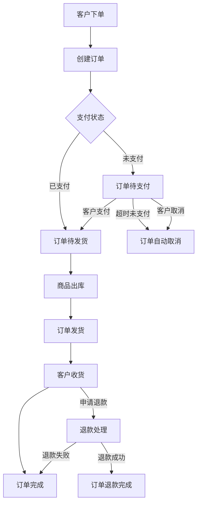
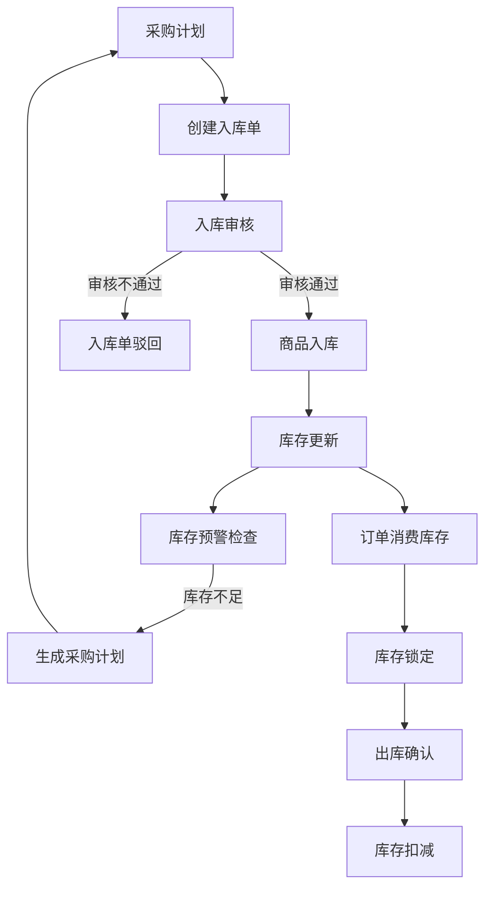
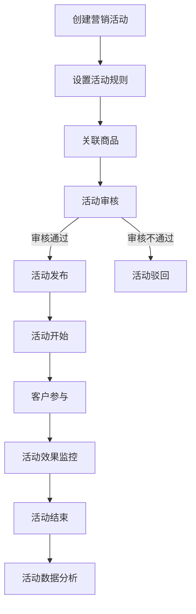

# 购物平台后台管理系统设计方案

## 系统概述

本设计方案基于帝可得后台管理系统的架构思想，为购物平台设计一套完整的后台管理系统。该系统将实现商品管理、订单处理、客户管理、营销活动等核心功能，提供高效的电商运营管理能力。

## 系统架构

系统采用前后端分离架构：
- 前端：Vue.js + Element UI
- 后端：Spring Boot + MyBatis
- 数据库：MySQL
- 缓存：Redis
- 文件存储：阿里云OSS

## 核心模块设计

### 1. 客户管理模块

#### 功能列表
- 客户列表查询与管理
- 客户详情查看
- 客户权限分配
- 客户状态管理（启用/禁用）
- 客户行为分析
- 会员等级管理

#### 核心表结构
```sql
-- 客户表
CREATE TABLE `tb_customer` (
  `id` BIGINT AUTO_INCREMENT COMMENT '客户ID',
  `username` VARCHAR(64) NOT NULL COMMENT '用户名',
  `password` VARCHAR(100) NOT NULL COMMENT '密码',
  `phone` VARCHAR(20) COMMENT '手机号',
  `email` VARCHAR(100) COMMENT '邮箱',
  `avatar` VARCHAR(255) COMMENT '头像',
  `gender` TINYINT DEFAULT 0 COMMENT '性别：0未知，1男，2女',
  `birthday` DATE COMMENT '生日',
  `customer_level` INT DEFAULT 0 COMMENT '会员等级',
  `status` TINYINT DEFAULT 1 COMMENT '状态：0禁用，1启用',
  `create_time` DATETIME DEFAULT CURRENT_TIMESTAMP COMMENT '创建时间',
  `update_time` DATETIME DEFAULT CURRENT_TIMESTAMP ON UPDATE CURRENT_TIMESTAMP COMMENT '更新时间',
  `last_login_time` DATETIME COMMENT '最后登录时间',
  `create_by` VARCHAR(64) COMMENT '创建人',
  `update_by` VARCHAR(64) COMMENT '更新人',
  PRIMARY KEY (`id`),
  UNIQUE KEY `idx_username` (`username`),
  UNIQUE KEY `idx_phone` (`phone`)
) ENGINE=InnoDB DEFAULT CHARSET=utf8mb4 COMMENT='客户表';

-- 会员等级表
CREATE TABLE `tb_customer_level` (
  `id` INT AUTO_INCREMENT COMMENT '等级ID',
  `level_name` VARCHAR(50) NOT NULL COMMENT '等级名称',
  `min_point` INT NOT NULL COMMENT '最低积分',
  `max_point` INT NOT NULL COMMENT '最高积分',
  `discount` DECIMAL(3,2) DEFAULT 1.00 COMMENT '折扣率',
  `description` VARCHAR(200) COMMENT '等级描述',
  `create_time` DATETIME DEFAULT CURRENT_TIMESTAMP COMMENT '创建时间',
  `update_time` DATETIME DEFAULT CURRENT_TIMESTAMP ON UPDATE CURRENT_TIMESTAMP COMMENT '更新时间',
  `create_by` VARCHAR(64) COMMENT '创建人',
  `update_by` VARCHAR(64) COMMENT '更新人',
  PRIMARY KEY (`id`)
) ENGINE=InnoDB DEFAULT CHARSET=utf8mb4 COMMENT='会员等级表';
```


### 2. 商品管理模块

#### 功能列表
- 商品分类管理
- 商品品牌管理
- 商品属性管理
- 商品规格管理
- 商品信息管理
- 商品上架/下架
- 商品批量导入/导出
- 商品审核

#### 核心表结构
```sql
-- 商品分类表
CREATE TABLE `tb_category` (
  `id` BIGINT AUTO_INCREMENT COMMENT '分类ID',
  `parent_id` BIGINT DEFAULT 0 COMMENT '父分类ID',
  `name` VARCHAR(50) NOT NULL COMMENT '分类名称',
  `level` INT DEFAULT 1 COMMENT '层级',
  `sort` INT DEFAULT 0 COMMENT '排序',
  `icon` VARCHAR(255) COMMENT '图标',
  `is_show` TINYINT DEFAULT 1 COMMENT '是否显示：0不显示，1显示',
  `create_time` DATETIME DEFAULT CURRENT_TIMESTAMP COMMENT '创建时间',
  `update_time` DATETIME DEFAULT CURRENT_TIMESTAMP ON UPDATE CURRENT_TIMESTAMP COMMENT '更新时间',
  `create_by` VARCHAR(64) COMMENT '创建人',
  `update_by` VARCHAR(64) COMMENT '更新人',
  PRIMARY KEY (`id`),
  KEY `idx_parent_id` (`parent_id`)
) ENGINE=InnoDB DEFAULT CHARSET=utf8mb4 COMMENT='商品分类表';

-- 商品品牌表
CREATE TABLE `tb_brand` (
  `id` BIGINT AUTO_INCREMENT COMMENT '品牌ID',
  `name` VARCHAR(50) NOT NULL COMMENT '品牌名称',
  `logo` VARCHAR(255) COMMENT '品牌logo',
  `description` VARCHAR(512) COMMENT '品牌描述',
  `sort` INT DEFAULT 0 COMMENT '排序',
  `is_show` TINYINT DEFAULT 1 COMMENT '是否显示：0不显示，1显示',
  `create_time` DATETIME DEFAULT CURRENT_TIMESTAMP COMMENT '创建时间',
  `update_time` DATETIME DEFAULT CURRENT_TIMESTAMP ON UPDATE CURRENT_TIMESTAMP COMMENT '更新时间',
  `create_by` VARCHAR(64) COMMENT '创建人',
  `update_by` VARCHAR(64) COMMENT '更新人',
  PRIMARY KEY (`id`)
) ENGINE=InnoDB DEFAULT CHARSET=utf8mb4 COMMENT='商品品牌表';

-- 商品表
CREATE TABLE `tb_product` (
  `id` BIGINT AUTO_INCREMENT COMMENT '商品ID',
  `title` VARCHAR(200) NOT NULL COMMENT '商品标题',
  `sub_title` VARCHAR(200) COMMENT '副标题',
  `category_id` BIGINT NOT NULL COMMENT '分类ID',
  `brand_id` BIGINT COMMENT '品牌ID',
  `price` DECIMAL(10,2) NOT NULL COMMENT '商品价格',
  `market_price` DECIMAL(10,2) COMMENT '市场价',
  `cost_price` DECIMAL(10,2) COMMENT '成本价',
  `stock` INT DEFAULT 0 COMMENT '库存',
  `sales` INT DEFAULT 0 COMMENT '销量',
  `main_image` VARCHAR(255) NOT NULL COMMENT '主图',
  `album` TEXT COMMENT '相册图片，多个以逗号分隔',
  `video` VARCHAR(255) COMMENT '视频URL',
  `unit` VARCHAR(20) COMMENT '单位',
  `weight` DECIMAL(10,2) COMMENT '重量(KG)',
  `keywords` VARCHAR(255) COMMENT '关键字',
  `status` TINYINT DEFAULT 1 COMMENT '状态：0下架，1上架',
  `introduction` TEXT COMMENT '商品介绍',
  `specification` TEXT COMMENT '规格参数',
  `merchant_id` BIGINT COMMENT '商家ID',
  `create_time` DATETIME DEFAULT CURRENT_TIMESTAMP COMMENT '创建时间',
  `update_time` DATETIME DEFAULT CURRENT_TIMESTAMP ON UPDATE CURRENT_TIMESTAMP COMMENT '更新时间',
  `create_by` VARCHAR(64) COMMENT '创建人',
  `update_by` VARCHAR(64) COMMENT '更新人',
  PRIMARY KEY (`id`),
  KEY `idx_category_id` (`category_id`),
  KEY `idx_brand_id` (`brand_id`),
  KEY `idx_status` (`status`),
  CONSTRAINT `fk_product_merchant` FOREIGN KEY (`merchant_id`) REFERENCES `tb_merchant` (`id`) ON DELETE RESTRICT ON UPDATE CASCADE,
  CONSTRAINT `fk_product_category` FOREIGN KEY (`category_id`) REFERENCES `tb_category` (`id`) ON DELETE RESTRICT ON UPDATE CASCADE,
  CONSTRAINT `fk_product_brand` FOREIGN KEY (`brand_id`) REFERENCES `tb_brand` (`id`) ON DELETE RESTRICT ON UPDATE CASCADE
) ENGINE=InnoDB DEFAULT CHARSET=utf8mb4 COMMENT='商品表';

-- 商品SKU表
CREATE TABLE `tb_product_sku` (
  `id` BIGINT AUTO_INCREMENT COMMENT 'SKU ID',
  `product_id` BIGINT NOT NULL COMMENT '商品ID',
  `sku_code` VARCHAR(64) NOT NULL COMMENT 'SKU编码',
  `specification` VARCHAR(200) COMMENT '规格值，JSON格式',
  `price` DECIMAL(10,2) NOT NULL COMMENT '价格',
  `stock` INT DEFAULT 0 COMMENT '库存',
  `sales` INT DEFAULT 0 COMMENT '销量',
  `image` VARCHAR(255) COMMENT 'SKU图片',
  `status` TINYINT DEFAULT 1 COMMENT '状态：0禁用，1启用',
  `create_time` DATETIME DEFAULT CURRENT_TIMESTAMP COMMENT '创建时间',
  `update_time` DATETIME DEFAULT CURRENT_TIMESTAMP ON UPDATE CURRENT_TIMESTAMP COMMENT '更新时间',
  PRIMARY KEY (`id`),
  KEY `idx_product_id` (`product_id`),
  UNIQUE KEY `uk_sku_code` (`sku_code`)
) ENGINE=InnoDB DEFAULT CHARSET=utf8mb4 COMMENT='商品SKU表';
```


### 3. 订单管理模块

#### 功能列表
- 订单列表查询
- 订单详情查看
- 订单状态管理
- 订单物流跟踪
- 订单退款处理
- 订单导出

#### 核心表结构
```sql
-- 订单表
CREATE TABLE `tb_order` (
  `id` BIGINT AUTO_INCREMENT COMMENT '订单ID',
  `order_no` VARCHAR(32) NOT NULL COMMENT '订单编号',
  `customer_id` BIGINT NOT NULL COMMENT '客户ID',
  `total_amount` DECIMAL(10,2) NOT NULL COMMENT '订单总金额',
  `pay_amount` DECIMAL(10,2) NOT NULL COMMENT '实付金额',
  `discount_amount` DECIMAL(10,2) DEFAULT 0 COMMENT '优惠金额',
  `shipping_fee` DECIMAL(10,2) DEFAULT 0 COMMENT '运费',
  `pay_type` TINYINT COMMENT '支付方式：1支付宝，2微信，3银行卡',
  `pay_time` DATETIME COMMENT '支付时间',
  `pay_no` VARCHAR(64) COMMENT '支付流水号',
  `order_status` TINYINT DEFAULT 0 COMMENT '订单状态：0待付款，1待发货，2待收货，3已完成，4已取消，5退款中，6已退款',
  `consignee` VARCHAR(50) NOT NULL COMMENT '收货人',
  `mobile` VARCHAR(20) NOT NULL COMMENT '联系电话',
  `address` VARCHAR(255) NOT NULL COMMENT '收货地址',
  `message` VARCHAR(512) COMMENT '订单备注',
  `merchant_id` BIGINT COMMENT '商家ID',
  `is_deleted` TINYINT DEFAULT 0 COMMENT '是否删除：0未删除，1已删除',
  `create_time` DATETIME DEFAULT CURRENT_TIMESTAMP COMMENT '创建时间',
  `update_time` DATETIME DEFAULT CURRENT_TIMESTAMP ON UPDATE CURRENT_TIMESTAMP COMMENT '更新时间',
  PRIMARY KEY (`id`),
  UNIQUE KEY `uk_order_no` (`order_no`),
  KEY `idx_customer_id` (`customer_id`),
  KEY `idx_order_status` (`order_status`)
) ENGINE=InnoDB DEFAULT CHARSET=utf8mb4 COMMENT='订单表';

-- 订单明细表
CREATE TABLE `tb_order_item` (
  `id` BIGINT AUTO_INCREMENT COMMENT '明细ID',
  `order_id` BIGINT NOT NULL COMMENT '订单ID',
  `order_no` VARCHAR(32) NOT NULL COMMENT '订单编号',
  `product_id` BIGINT NOT NULL COMMENT '商品ID',
  `sku_id` BIGINT NOT NULL COMMENT 'SKU ID',
  `product_name` VARCHAR(200) NOT NULL COMMENT '商品名称',
  `sku_spec` VARCHAR(200) COMMENT 'SKU规格',
  `product_image` VARCHAR(255) COMMENT '商品图片',
  `price` DECIMAL(10,2) NOT NULL COMMENT '原价',
  `actual_price` DECIMAL(10,2) NOT NULL COMMENT '实际价格',
  `quantity` INT NOT NULL COMMENT '数量',
  `total_amount` DECIMAL(10,2) NOT NULL COMMENT '总金额',
  `create_time` DATETIME DEFAULT CURRENT_TIMESTAMP COMMENT '创建时间',
  PRIMARY KEY (`id`),
  KEY `idx_order_id` (`order_id`),
  KEY `idx_order_no` (`order_no`),
  KEY `idx_product_id` (`product_id`),
  KEY `idx_sku_id` (`sku_id`)
) ENGINE=InnoDB DEFAULT CHARSET=utf8mb4 COMMENT='订单明细表';

-- 订单物流表
CREATE TABLE `tb_order_logistics` (
  `id` BIGINT AUTO_INCREMENT COMMENT '物流ID',
  `order_id` BIGINT NOT NULL COMMENT '订单ID',
  `order_no` VARCHAR(32) NOT NULL COMMENT '订单编号',
  `shipping_method` VARCHAR(50) COMMENT '配送方式',
  `logistics_company` VARCHAR(50) COMMENT '物流公司',
  `logistics_no` VARCHAR(50) COMMENT '物流单号',
  `shipping_time` DATETIME COMMENT '发货时间',
  `delivery_time` DATETIME COMMENT '送达时间',
  `logistics_status` TINYINT DEFAULT 0 COMMENT '物流状态：0待发货，1已发货，2已签收',
  `logistics_info` TEXT COMMENT '物流信息',
  `create_time` DATETIME DEFAULT CURRENT_TIMESTAMP COMMENT '创建时间',
  `update_time` DATETIME DEFAULT CURRENT_TIMESTAMP ON UPDATE CURRENT_TIMESTAMP COMMENT '更新时间',
  PRIMARY KEY (`id`),
  KEY `idx_order_id` (`order_id`),
  KEY `idx_order_no` (`order_no`),
  KEY `idx_logistics_no` (`logistics_no`)
) ENGINE=InnoDB DEFAULT CHARSET=utf8mb4 COMMENT='订单物流表';
```


### 4. 营销管理模块

#### 功能列表
- 优惠券管理
- 满减活动管理
- 拼团活动管理
- 秒杀活动管理
- 限时折扣管理
- 积分商城管理
- 活动数据分析

#### 核心表结构
```sql
-- 优惠券表
CREATE TABLE `tb_coupon` (
  `id` BIGINT AUTO_INCREMENT COMMENT '优惠券ID',
  `name` VARCHAR(100) NOT NULL COMMENT '优惠券名称',
  `type` TINYINT NOT NULL COMMENT '优惠券类型：1满减券，2折扣券，3直减券',
  `value` DECIMAL(10,2) NOT NULL COMMENT '优惠券面值',
  `min_point` DECIMAL(10,2) DEFAULT 0 COMMENT '使用门槛，0表示无门槛',
  `start_time` DATETIME NOT NULL COMMENT '开始时间',
  `end_time` DATETIME NOT NULL COMMENT '结束时间',
  `total` INT DEFAULT 0 COMMENT '发行量，0表示不限量',
  `used` INT DEFAULT 0 COMMENT '已领取数量',
  `receive_count` INT DEFAULT 1 COMMENT '每人限领数量',
  `status` TINYINT DEFAULT 1 COMMENT '状态：0禁用，1启用',
  `description` VARCHAR(512) COMMENT '使用说明',
  `merchant_id` BIGINT COMMENT '商家ID',
  `create_time` DATETIME DEFAULT CURRENT_TIMESTAMP COMMENT '创建时间',
  `update_time` DATETIME DEFAULT CURRENT_TIMESTAMP ON UPDATE CURRENT_TIMESTAMP COMMENT '更新时间',
  `create_by` VARCHAR(64) COMMENT '创建人',
  `update_by` VARCHAR(64) COMMENT '更新人',
  PRIMARY KEY (`id`)
) ENGINE=InnoDB DEFAULT CHARSET=utf8mb4 COMMENT='优惠券表';

-- 客户优惠券表
CREATE TABLE `tb_customer_coupon` (
  `id` BIGINT AUTO_INCREMENT COMMENT 'ID',
  `coupon_id` BIGINT NOT NULL COMMENT '优惠券ID',
  `customer_id` BIGINT NOT NULL COMMENT '客户ID',
  `status` TINYINT DEFAULT 0 COMMENT '状态：0未使用，1已使用，2已过期',
  `use_time` DATETIME COMMENT '使用时间',
  `order_id` BIGINT COMMENT '订单ID',
  `get_time` DATETIME DEFAULT CURRENT_TIMESTAMP COMMENT '领取时间',
  PRIMARY KEY (`id`),
  KEY `idx_coupon_id` (`coupon_id`),
  KEY `idx_customer_id` (`customer_id`)
) ENGINE=InnoDB DEFAULT CHARSET=utf8mb4 COMMENT='客户优惠券表';

-- 营销活动表
CREATE TABLE `tb_promotion` (
  `id` BIGINT AUTO_INCREMENT COMMENT '活动ID',
  `name` VARCHAR(100) NOT NULL COMMENT '活动名称',
  `type` TINYINT NOT NULL COMMENT '活动类型：1秒杀，2拼团，3满减，4限时折扣',
  `start_time` DATETIME NOT NULL COMMENT '开始时间',
  `end_time` DATETIME NOT NULL COMMENT '结束时间',
  `status` TINYINT DEFAULT 0 COMMENT '状态：0未开始，1进行中，2已结束，3已取消',
  `rules` TEXT COMMENT '活动规则，JSON格式',
  `description` VARCHAR(512) COMMENT '活动描述',
  `banner` VARCHAR(255) COMMENT '活动banner',
  `merchant_id` BIGINT COMMENT '商家ID',
  `create_time` DATETIME DEFAULT CURRENT_TIMESTAMP COMMENT '创建时间',
  `update_time` DATETIME DEFAULT CURRENT_TIMESTAMP ON UPDATE CURRENT_TIMESTAMP COMMENT '更新时间',
  `create_by` VARCHAR(64) COMMENT '创建人',
  `update_by` VARCHAR(64) COMMENT '更新人',
  PRIMARY KEY (`id`),
  KEY `idx_type` (`type`),
  KEY `idx_status` (`status`),
  KEY `idx_time` (`start_time`, `end_time`)
) ENGINE=InnoDB DEFAULT CHARSET=utf8mb4 COMMENT='营销活动表';

-- 活动商品关联表
CREATE TABLE `tb_promotion_product` (
  `id` BIGINT AUTO_INCREMENT COMMENT 'ID',
  `promotion_id` BIGINT NOT NULL COMMENT '活动ID',
  `product_id` BIGINT NOT NULL COMMENT '商品ID',
  `sku_id` BIGINT COMMENT 'SKU ID',
  `promotion_price` DECIMAL(10,2) COMMENT '活动价格',
  `stock_limit` INT DEFAULT 0 COMMENT '限购数量，0表示不限购',
  `create_time` DATETIME DEFAULT CURRENT_TIMESTAMP COMMENT '创建时间',
  PRIMARY KEY (`id`),
  KEY `idx_promotion_id` (`promotion_id`),
  KEY `idx_product_id` (`product_id`),
  KEY `idx_sku_id` (`sku_id`)
) ENGINE=InnoDB DEFAULT CHARSET=utf8mb4 COMMENT='活动商品关联表';
```


### 5. 商家管理模块

#### 功能列表
- 商家信息管理
- 商家审核
- 商家结算
- 商家商品管理
- 商家评级

#### 核心表结构
```sql
-- 商家表
CREATE TABLE `tb_merchant` (
  `id` BIGINT AUTO_INCREMENT COMMENT '商家ID',
  `name` VARCHAR(100) NOT NULL COMMENT '商家名称',
  `code` VARCHAR(32) COMMENT '商家编码',
  `contact_person` VARCHAR(50) COMMENT '联系人',
  `contact_phone` VARCHAR(20) COMMENT '联系电话',
  `email` VARCHAR(100) COMMENT '邮箱',
  `address` VARCHAR(255) COMMENT '地址',
  `business_license` VARCHAR(255) COMMENT '营业执照',
  `category` VARCHAR(200) COMMENT '经营类目',
  `profit_ratio` INT DEFAULT 0 COMMENT '分成比例(%)',
  `account` VARCHAR(64) COMMENT '登录账号',
  `password` VARCHAR(100) COMMENT '登录密码',
  `status` TINYINT DEFAULT 1 COMMENT '状态：0禁用，1启用',
  `level` INT DEFAULT 1 COMMENT '商家等级',
  `score` INT DEFAULT 100 COMMENT '评分',
  `create_time` DATETIME DEFAULT CURRENT_TIMESTAMP COMMENT '创建时间',
  `update_time` DATETIME DEFAULT CURRENT_TIMESTAMP ON UPDATE CURRENT_TIMESTAMP COMMENT '更新时间',
  `create_by` VARCHAR(64) COMMENT '创建人',
  `update_by` VARCHAR(64) COMMENT '更新人',
  PRIMARY KEY (`id`),
  UNIQUE KEY `uk_code` (`code`)
) ENGINE=InnoDB DEFAULT CHARSET=utf8mb4 COMMENT='商家表';

-- 商家结算表
CREATE TABLE `tb_merchant_settlement` (
  `id` BIGINT AUTO_INCREMENT COMMENT '结算ID',
  `merchant_id` BIGINT NOT NULL COMMENT '商家ID',
  `settlement_no` VARCHAR(32) NOT NULL COMMENT '结算单号',
  `settlement_start` DATE NOT NULL COMMENT '结算开始日期',
  `settlement_end` DATE NOT NULL COMMENT '结算结束日期',
  `order_count` INT DEFAULT 0 COMMENT '订单数量',
  `total_amount` DECIMAL(12,2) DEFAULT 0 COMMENT '结算总金额',
  `platform_amount` DECIMAL(12,2) DEFAULT 0 COMMENT '平台分成',
  `merchant_amount` DECIMAL(12,2) DEFAULT 0 COMMENT '商家分成',
  `status` TINYINT DEFAULT 0 COMMENT '状态：0待结算，1已结算',
  `settlement_time` DATETIME COMMENT '结算时间',
  `remark` VARCHAR(512) COMMENT '备注',
  `create_time` DATETIME DEFAULT CURRENT_TIMESTAMP COMMENT '创建时间',
  `update_time` DATETIME DEFAULT CURRENT_TIMESTAMP ON UPDATE CURRENT_TIMESTAMP COMMENT '更新时间',
  PRIMARY KEY (`id`),
  UNIQUE KEY `uk_settlement_no` (`settlement_no`),
  KEY `idx_merchant_id` (`merchant_id`),
  KEY `idx_settlement_time` (`settlement_time`)
) ENGINE=InnoDB DEFAULT CHARSET=utf8mb4 COMMENT='商家结算表';
```


### 6. 库存管理模块

#### 功能列表
- 库存查询
- 库存预警
- 入库管理
- 出库管理
- 库存盘点
- 库存调拨
- 库存报表

#### 核心表结构
```sql
-- 仓库表
CREATE TABLE `tb_warehouse` (
  `id` BIGINT AUTO_INCREMENT COMMENT '仓库ID',
  `name` VARCHAR(100) NOT NULL COMMENT '仓库名称',
  `code` VARCHAR(32) COMMENT '仓库编码',
  `address` VARCHAR(255) COMMENT '仓库地址',
  `contact_person` VARCHAR(50) COMMENT '联系人',
  `contact_phone` VARCHAR(20) COMMENT '联系电话',
  `merchant_id` BIGINT COMMENT '商家ID',
  `status` TINYINT DEFAULT 1 COMMENT '状态：0禁用，1启用',
  `create_time` DATETIME DEFAULT CURRENT_TIMESTAMP COMMENT '创建时间',
  `update_time` DATETIME DEFAULT CURRENT_TIMESTAMP ON UPDATE CURRENT_TIMESTAMP COMMENT '更新时间',
  `create_by` VARCHAR(64) COMMENT '创建人',
  `update_by` VARCHAR(64) COMMENT '更新人',
  PRIMARY KEY (`id`),
  UNIQUE KEY `uk_code` (`code`)
) ENGINE=InnoDB DEFAULT CHARSET=utf8mb4 COMMENT='仓库表';

-- 库存表
CREATE TABLE `tb_inventory` (
  `id` BIGINT AUTO_INCREMENT COMMENT '库存ID',
  `warehouse_id` BIGINT NOT NULL COMMENT '仓库ID',
  `product_id` BIGINT NOT NULL COMMENT '商品ID',
  `sku_id` BIGINT NOT NULL COMMENT 'SKU ID',
  `quantity` INT DEFAULT 0 COMMENT '数量',
  `lock_quantity` INT DEFAULT 0 COMMENT '锁定数量',
  `available_quantity` INT DEFAULT 0 COMMENT '可用数量',
  `alert_quantity` INT DEFAULT 0 COMMENT '预警数量',
  `cost_price` DECIMAL(10,2) COMMENT '成本价',
  `merchant_id` BIGINT COMMENT '商家ID',
  `update_time` DATETIME DEFAULT CURRENT_TIMESTAMP ON UPDATE CURRENT_TIMESTAMP COMMENT '更新时间',
  PRIMARY KEY (`id`),
  UNIQUE KEY `uk_warehouse_sku` (`warehouse_id`, `sku_id`),
  KEY `idx_product_id` (`product_id`),
  KEY `idx_sku_id` (`sku_id`)
) ENGINE=InnoDB DEFAULT CHARSET=utf8mb4 COMMENT='库存表';

-- 入库单表
CREATE TABLE `tb_stock_in` (
  `id` BIGINT AUTO_INCREMENT COMMENT '入库单ID',
  `in_no` VARCHAR(32) NOT NULL COMMENT '入库单号',
  `warehouse_id` BIGINT NOT NULL COMMENT '仓库ID',
  `merchant_id` BIGINT COMMENT '商家ID',
  `in_type` TINYINT DEFAULT 1 COMMENT '入库类型：1采购入库，2退货入库，3调拨入库',
  `status` TINYINT DEFAULT 0 COMMENT '状态：0待审核，1已审核，2已取消',
  `total_quantity` INT DEFAULT 0 COMMENT '入库总数量',
  `total_amount` DECIMAL(12,2) DEFAULT 0 COMMENT '入库总金额',
  `operator` VARCHAR(64) COMMENT '操作人',
  `operator_id` BIGINT COMMENT '操作人ID',
  `audit_time` DATETIME COMMENT '审核时间',
  `auditor` VARCHAR(64) COMMENT '审核人',
  `remark` VARCHAR(512) COMMENT '备注',
  `create_time` DATETIME DEFAULT CURRENT_TIMESTAMP COMMENT '创建时间',
  `update_time` DATETIME DEFAULT CURRENT_TIMESTAMP ON UPDATE CURRENT_TIMESTAMP COMMENT '更新时间',
  PRIMARY KEY (`id`),
  UNIQUE KEY `uk_in_no` (`in_no`),
  KEY `idx_warehouse_id` (`warehouse_id`),
  KEY `idx_merchant_id` (`merchant_id`)
) ENGINE=InnoDB DEFAULT CHARSET=utf8mb4 COMMENT='入库单表';

-- 入库单明细表
CREATE TABLE `tb_stock_in_item` (
  `id` BIGINT AUTO_INCREMENT COMMENT '明细ID',
  `in_id` BIGINT NOT NULL COMMENT '入库单ID',
  `in_no` VARCHAR(32) NOT NULL COMMENT '入库单号',
  `product_id` BIGINT NOT NULL COMMENT '商品ID',
  `sku_id` BIGINT NOT NULL COMMENT 'SKU ID',
  `product_name` VARCHAR(200) NOT NULL COMMENT '商品名称',
  `sku_spec` VARCHAR(200) COMMENT 'SKU规格',
  `quantity` INT NOT NULL COMMENT '入库数量',
  `cost_price` DECIMAL(10,2) COMMENT '成本价',
  `amount` DECIMAL(12,2) DEFAULT 0 COMMENT '金额',
  `create_time` DATETIME DEFAULT CURRENT_TIMESTAMP COMMENT '创建时间',
  PRIMARY KEY (`id`),
  KEY `idx_in_id` (`in_id`),
  KEY `idx_in_no` (`in_no`),
  KEY `idx_product_id` (`product_id`),
  KEY `idx_sku_id` (`sku_id`)
) ENGINE=InnoDB DEFAULT CHARSET=utf8mb4 COMMENT='入库单明细表';

-- 出库单表
CREATE TABLE `tb_stock_out` (
  `id` BIGINT AUTO_INCREMENT COMMENT '出库单ID',
  `out_no` VARCHAR(32) NOT NULL COMMENT '出库单号',
  `warehouse_id` BIGINT NOT NULL COMMENT '仓库ID',
  `merchant_id` BIGINT COMMENT '商家ID',
  `out_type` TINYINT DEFAULT 1 COMMENT '出库类型：1销售出库，2退货出库，3调拨出库',
  `status` TINYINT DEFAULT 0 COMMENT '状态：0待审核，1已审核，2已取消',
  `total_quantity` INT DEFAULT 0 COMMENT '出库总数量',
  `total_amount` DECIMAL(12,2) DEFAULT 0 COMMENT '出库总金额',
  `operator` VARCHAR(64) COMMENT '操作人',
  `operator_id` BIGINT COMMENT '操作人ID',
  `audit_time` DATETIME COMMENT '审核时间',
  `auditor` VARCHAR(64) COMMENT '审核人',
  `order_id` BIGINT COMMENT '关联订单ID',
  `order_no` VARCHAR(32) COMMENT '关联订单号',
  `remark` VARCHAR(512) COMMENT '备注',
  `create_time` DATETIME DEFAULT CURRENT_TIMESTAMP COMMENT '创建时间',
  `update_time` DATETIME DEFAULT CURRENT_TIMESTAMP ON UPDATE CURRENT_TIMESTAMP COMMENT '更新时间',
  PRIMARY KEY (`id`),
  UNIQUE KEY `uk_out_no` (`out_no`),
  KEY `idx_warehouse_id` (`warehouse_id`),
  KEY `idx_merchant_id` (`merchant_id`),
  KEY `idx_order_id` (`order_id`),
  KEY `idx_order_no` (`order_no`),
  CONSTRAINT `fk_stock_out_merchant` FOREIGN KEY (`merchant_id`) REFERENCES `tb_merchant` (`id`) ON DELETE RESTRICT ON UPDATE CASCADE,
  CONSTRAINT `fk_stock_out_warehouse` FOREIGN KEY (`warehouse_id`) REFERENCES `tb_warehouse` (`id`) ON DELETE RESTRICT ON UPDATE CASCADE
) ENGINE=InnoDB DEFAULT CHARSET=utf8mb4 COMMENT='出库单表';

-- 出库单明细表
CREATE TABLE `tb_stock_out_item` (
  `id` BIGINT AUTO_INCREMENT COMMENT '明细ID',
  `out_id` BIGINT NOT NULL COMMENT '出库单ID',
  `out_no` VARCHAR(32) NOT NULL COMMENT '出库单号',
  `product_id` BIGINT NOT NULL COMMENT '商品ID',
  `sku_id` BIGINT NOT NULL COMMENT 'SKU ID',
  `product_name` VARCHAR(200) NOT NULL COMMENT '商品名称',
  `sku_spec` VARCHAR(200) COMMENT 'SKU规格',
  `quantity` INT NOT NULL COMMENT '出库数量',
  `cost_price` DECIMAL(10,2) COMMENT '成本价',
  `amount` DECIMAL(12,2) DEFAULT 0 COMMENT '金额',
  `create_time` DATETIME DEFAULT CURRENT_TIMESTAMP COMMENT '创建时间',
  PRIMARY KEY (`id`),
  KEY `idx_out_id` (`out_id`),
  KEY `idx_out_no` (`out_no`),
  KEY `idx_product_id` (`product_id`),
  KEY `idx_sku_id` (`sku_id`)
) ENGINE=InnoDB DEFAULT CHARSET=utf8mb4 COMMENT='出库单明细表';

-- 出库单表测试数据（基于现有商家ID: 1, 2, 3）
INSERT INTO `tb_stock_out` (`out_no`, `warehouse_id`, `merchant_id`, `out_type`, `status`, `total_quantity`, `total_amount`, `operator`, `operator_id`, `audit_time`, `auditor`, `order_id`, `order_no`, `remark`, `create_time`) VALUES
-- 苹果官方旗舰店(ID=1)的出库记录
('OUT20250401001', 1, 1, 1, 1, 20, 39980.00, '张经理', 101, '2025-04-01 10:30:00', '系统管理员', 20001, 'ORD20250401001', 'iPhone新品发售首批出库', '2025-04-01 09:15:00'),
('OUT20250402001', 1, 1, 2, 0, 5, 9995.00, '张经理', 101, NULL, NULL, NULL, NULL, 'iPhone返厂维修批次', '2025-04-02 11:20:00'),
('OUT20250403001', 2, 1, 3, 1, 15, 22500.00, '张助理', 102, '2025-04-03 14:30:00', '张经理', NULL, NULL, '调拨至上海分仓', '2025-04-03 13:25:00'),

-- 三星官方旗舰店(ID=2)的出库记录
('OUT20250401002', 3, 2, 1, 1, 12, 23988.00, '李经理', 201, '2025-04-01 11:45:00', '系统管理员', 20002, 'ORD20250401002', 'Galaxy系列促销活动出货', '2025-04-01 10:30:00'),
('OUT20250402002', 3, 2, 1, 2, 8, 5592.00, '李助理', 202, NULL, NULL, 20003, 'ORD20250402001', '客户取消订单', '2025-04-02 09:40:00'),

-- 耐克官方旗舰店(ID=3)的出库记录
('OUT20250401003', 3, 3, 1, 1, 30, 12000.00, '王经理', 301, '2025-04-01 16:30:00', '系统管理员', 20004, 'ORD20250401003', '春季新款运动鞋发货', '2025-04-01 15:20:00'),
('OUT20250402003', 1, 3, 1, 0, 25, 8750.00, '王助理', 302, NULL, NULL, 20005, 'ORD20250402002', '团购订单待审核', '2025-04-02 14:15:00'),
('OUT20250403002', 2, 3, 2, 1, 10, 3500.00, '王经理', 301, '2025-04-03 11:20:00', '质检部门', NULL, NULL, '质量问题退货', '2025-04-03 10:05:00');


```


### 7. 数据统计与报表模块

#### 功能列表
- 销售统计
- 客户分析
- 商品分析
- 营销效果分析
- 地区分析
- 商家数据
- 数据导出

#### 核心表结构
```sql
-- 销售统计表
CREATE TABLE `tb_sales_statistic` (
  `id` BIGINT AUTO_INCREMENT COMMENT 'ID',
  `statistic_date` DATE NOT NULL COMMENT '统计日期',
  `order_count` INT DEFAULT 0 COMMENT '订单数',
  `order_amount` DECIMAL(12,2) DEFAULT 0 COMMENT '订单金额',
  `customer_count` INT DEFAULT 0 COMMENT '下单客户数',
  `new_customer_count` INT DEFAULT 0 COMMENT '新客户数',
  `product_count` INT DEFAULT 0 COMMENT '售出商品数',
  `sku_count` INT DEFAULT 0 COMMENT '售出SKU数',
  `refund_count` INT DEFAULT 0 COMMENT '退款订单数',
  `refund_amount` DECIMAL(12,2) DEFAULT 0 COMMENT '退款金额',
  `merchant_id` BIGINT COMMENT '商家ID',
  `create_time` DATETIME DEFAULT CURRENT_TIMESTAMP COMMENT '创建时间',
  PRIMARY KEY (`id`),
  UNIQUE KEY `uk_date_merchant` (`statistic_date`, `merchant_id`)
) ENGINE=InnoDB DEFAULT CHARSET=utf8mb4 COMMENT='销售统计表';

-- 商品销售排行表
CREATE TABLE `tb_product_rank` (
  `id` BIGINT AUTO_INCREMENT COMMENT 'ID',
  `statistic_date` DATE NOT NULL COMMENT '统计日期',
  `product_id` BIGINT NOT NULL COMMENT '商品ID',
  `product_name` VARCHAR(200) NOT NULL COMMENT '商品名称',
  `sales_count` INT DEFAULT 0 COMMENT '销售数量',
  `sales_amount` DECIMAL(12,2) DEFAULT 0 COMMENT '销售金额',
  `merchant_id` BIGINT COMMENT '商家ID',
  `create_time` DATETIME DEFAULT CURRENT_TIMESTAMP COMMENT '创建时间',
  PRIMARY KEY (`id`),
  UNIQUE KEY `uk_date_product` (`statistic_date`, `product_id`, `merchant_id`)
) ENGINE=InnoDB DEFAULT CHARSET=utf8mb4 COMMENT='商品销售排行表';
```


## 系统功能关系图

```
购物平台后台管理系统
├── 客户管理
│   ├── 客户列表
│   ├── 客户详情
│   ├── 会员等级
│   ├── 客户行为分析
│   └── 客户权限
├── 商品管理
│   ├── 商品分类
│   ├── 商品品牌
│   ├── 商品属性
│   ├── 商品规格
│   ├── 商品信息
│   └── 商品导入/导出
├── 订单管理
│   ├── 订单列表
│   ├── 订单详情
│   ├── 订单状态
│   ├── 物流管理
│   └── 退款管理
├── 营销管理
│   ├── 优惠券
│   ├── 满减活动
│   ├── 拼团活动
│   ├── 秒杀活动
│   ├── 限时折扣
│   └── 积分商城
├── 商家管理
│   ├── 商家列表
│   ├── 商家详情
│   ├── 商家审核
│   ├── 商家结算
│   └── 商家评级
├── 库存管理
│   ├── 仓库管理
│   ├── 库存查询
│   ├── 库存预警
│   ├── 入库管理
│   ├── 出库管理
│   ├── 库存盘点
│   └── 库存调拨
└── 数据统计与报表
    ├── 销售统计
    ├── 客户分析
    ├── 商品分析
    ├── 营销效果分析
    ├── 地区销售分析
    ├── 商家数据
    └── 数据导出
```


## 系统关键流程

### 1. 订单处理流程




### 2. 库存管理流程




### 3. 营销活动流程

